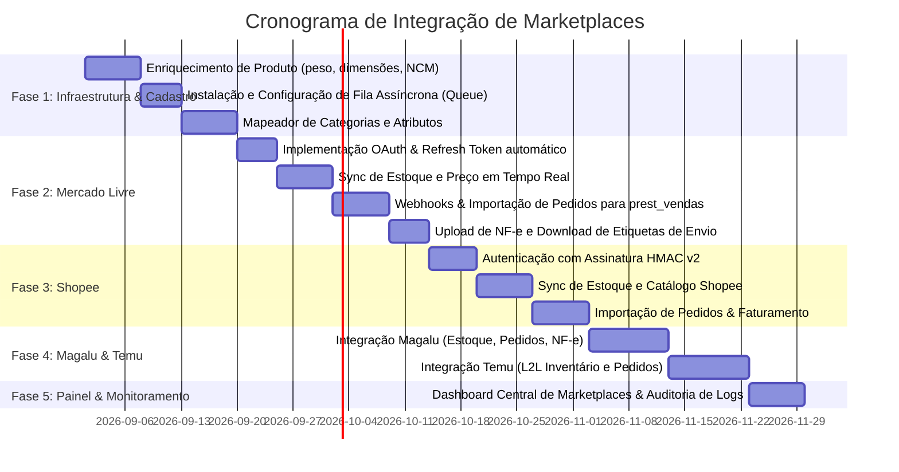

# 📘 Especificação Técnica e Guia de Integração: Hub de Marketplaces (Pulse ERP)

Este documento descreve a análise completa do projeto **Pulse ERP** e detalha todos os requisitos técnicos, arquiteturais, fiscais e operacionais necessários para a integração com **Mercado Livre / Mercado Pago**, **Shopee**, **Magazine Luiza (Magalu)**, **Temu** e outros marketplaces.

---

## 1. Diagnóstico do Estado Atual do Projeto Pulse

A análise do repositório `/srv/http/pulse` revelou que o projeto possui uma **estrutura inicial bem planejada (esqueleto/MVP)** no módulo `modules/marketplace`, porém a maioria dos fluxos ainda opera com *stubs* (simulações) e precisa de complementação técnica para produção.

### 1.1 O que já está implementado
* **Estrutura de Banco de Dados (`sql/postgres/013_create_marketplace_tables.sql`):**
  * `prest_marketplace_config`: Armazena credenciais (Client ID, Secret, tokens) e flags por usuário/seller.
  * `prest_marketplace_produto`: Vínculo entre SKU interno do Pulse e ID do produto no marketplace.
  * `prest_marketplace_pedido`: Armazena pedidos importados e status.
  * `prest_marketplace_pedido_item`: Itens vinculados do pedido.
  * `prest_marketplace_sync_log`: Auditoria e histórico de logs de sincronização.
* **Componentes Base (`modules/marketplace/components/`):**
  * `MarketplaceService.php`: Classe abstrata com métodos padronizados (`syncProdutos`, `syncEstoque`, `importPedidos`, `updatePedidoStatus`, `processWebhook`).
  * `OrderEventProcessor.php`: Transforma dados brutos do pedido em registros no Pulse.
  * `MercadoLivreWebhookHandler.php`: Validador de assinatura e roteador de webhooks do Mercado Livre.
  * `MarketplaceSyncManager.php`: Disparador central de sincronização de estoque chamado no `afterSave` do `Produto.php`.
* **Módulo Mercado Pago (`modules/api/controllers/MercadoPagoController.php`):**
  * Integração completa para pagamento via Checkout Pro, Pix e Maquininhas Point.
* **Módulo Fiscal (`components/nfe/`):**
  * Emissão de NF-e (XML/Danfe), fundamental para liberar etiquetas de envio em marketplaces brasileiros.

### 1.2 Gaps e Pontos Críticos a Desenvolver
1. **Diferenciação Mercado Pago vs Mercado Livre:**
   * O **Mercado Pago** é a instituição financeira/gateway (já integrado para cobranças no PDV/API).
   * O **Mercado Livre (MELI)** é o canal de vendas/marketplace (catálogo, estoque, pedidos, perguntas e Mercado Envios).
2. **Dados Cadastrais de Produtos Faltantes no ERP:**
   * Marketplaces exigem: **Dimensões da embalagem (Altura, Largura, Comprimento em cm)**, **Peso Bruto/Líquido (em kg ou gramas)**, **Código EAN/GTIN** e **NCM**. A tabela `prest_produtos` precisa ser enriquecida com essas colunas.
3. **Fila Assíncrona (Queue/Jobs):**
   * Atualmente, o `Produto::afterSave` executa o sync de estoque de forma síncrona. Se a API externa oscilar ou demorar 2 segundos, a tela de edição do ERP ou fechamento de venda no PDV travará. É mandatório adotar **Fila Assíncrona** (Yii2 Queue com PostgreSQL ou Redis).
4. **Implementação Real dos SDKs/HTTP Clients:**
   * Os arquivos `MercadoLivreService.php`, `ShopeeService.php`, etc., atualmente retornam `['success' => true]` sem efetuar chamadas reais às APIs das plataformas.
5. **Mapeamento de Categorias e Atributos:**
   * Cada marketplace possui sua própria taxonomia e atributos obrigatórios (ex: Voltagem, Gênero, Material, Marca). É necessária uma tabela de mapeamento entre categorias locais e categorias externas.

---

## 2. Requisitos de Contas e Credenciamento por Plataforma

Para operar em produção, a empresa/desenvolvedor e os sellers precisam dos seguintes acessos:

| Marketplace | Portal do Desenvolvedor | Tipo de Autenticação | Credenciais Necessárias |
| :--- | :--- | :--- | :--- |
| **Mercado Livre** | [developers.mercadolivre.com.br](https://developers.mercadolivre.com.br/) | OAuth 2.0 (Authorization Code + Refresh Token) | `App ID` (Client ID), `Client Secret`, `Redirect URI` |
| **Shopee** | [open.shopee.com](https://open.shopee.com/) | HMAC-SHA256 + OAuth 2.0 (API v2) | `Partner ID`, `Partner Key`, `Shop ID`, `Access Token` |
| **Magalu** | [developers.magalu.com](https://developers.magalu.com/) (ou IntegraCommerce) | API Token / OAuth 2.0 | `API Key`, `Seller ID`, `Client Secret` |
| **Temu** | [seller.temu.com](https://seller.temu.com/) / Temu Open Platform | App Key + Sign HMAC / Token L2L | `App Key`, `App Secret`, `Access Token`, `Seller ID` |
| **Mercado Pago** | [mercadopago.com.br/developers](https://www.mercadopago.com.br/developers/) | OAuth / Access Token Bearer | `Public Key`, `Access Token`, `Client ID`, `Client Secret` |

---

## 3. Arquitetura Técnica Recomendada

```
                                  ┌────────────────────────┐
                                  │   Pulse ERP (MySQL/PG) │
                                  └───────────┬────────────┘
                                              │
                    ┌─────────────────────────┴─────────────────────────┐
                    ▼                                                   ▼
       ┌────────────────────────┐                          ┌────────────────────────┐
       │   Webhook Controller   │                          │   Yii2 Queue / Worker  │
       │ (Notificações em Real  │                          │  (Sync Assíncrono de   │
       │         Time)          │                          │   Estoque e Catálogo)  │
       └────────────┬───────────┘                          └───────────┬────────────┘
                    │                                                   │
     ┌──────────────┼──────────────────────────┬────────────────────────┤
     ▼              ▼                          ▼                        ▼
┌──────────┐  ┌──────────┐               ┌──────────┐             ┌──────────┐
│ Mercado  │  │  Shopee  │               │  Magalu  │             │   Temu   │
│  Livre   │  │  API v2  │               │   API    │             │   Open   │
└──────────┘  └──────────┘               └──────────┘             └──────────┘
```

### 3.1 Camada 1: Autenticação e Renovação Automática de Tokens
* **Mercado Livre**: O token expira a cada 6 horas. O sistema deve ter um **Cron Job / Middleware** que verifica `token_expira_em` e dispara o endpoint `https://api.mercadolibre.com/oauth/token` com `grant_type=refresh_token`.
* **Shopee**: Utiliza assinatura criptográfica `HMAC-SHA256(partner_id + path + timestamp + access_token + shop_id)` gerada dinamicamente a cada requisição.
* **Magalu & Temu**: Gerenciamento de credenciais centralizado em `prest_marketplace_config`.

### 3.2 Camada 2: Sincronização de Produtos e Catálogo
1. **Publicação / Vínculo (Listing):**
   * Possibilidade de criar o anúncio a partir do Pulse ERP ou vincular um anúncio existente (Matching por SKU/Código de Barras).
2. **Atributos Obrigatórios:**
   * Título (respeitando limite de caracteres de cada canal).
   * Preço de De/Por (com regra de margem/acréscimo de comissão do marketplace configurável).
   * Fotos em alta resolução (URLs públicas servidas pelo Pulse).
   * Ficha técnica (Marca, Modelo, EAN, NCM).
   * Dimensões da embalagem e Peso.

### 3.3 Camada 3: Sincronização Bidirecional de Estoque
* **Venda realizada no ERP físico (PDV / Venda Expressa):**
  * `Produto::afterSave` insere job na fila: `SyncEstoqueJob(produto_id, novo_estoque)`.
  * O worker notifica todas as contas ativas do seller nos marketplaces para atualizar a quantidade disponível.
* **Venda realizada no Marketplace:**
  * O webhook do marketplace notifica o Pulse.
  * O Pulse reserva o estoque imediatamente (`estoque_atual - quantidade`).
  * Em seguida, propaga a redução de estoque para os **outros** marketplaces conectados, evitando *furo de estoque* (venda dupla).

### 3.4 Camada 4: Gestão de Pedidos (Order Lifecycle)
1. **Recebimento de Notificação (Webhook):**
   * Endpoint único e seguro: `POST /marketplace/webhook/receive?marketplace=mercado-livre` (Shopee, Magalu, Temu).
   * Validação de assinatura criptográfica (`x-signature`, token de segurança).
2. **Importação e Conversão em Venda Pulse:**
   * Salva no `prest_marketplace_pedido`.
   * Cria o registro em `prest_vendas` e `prest_vendas_itens` associado ao cliente do marketplace (com CPF/CNPJ).
   * Status mapeados:
     * `Aguardando Pagamento` ➔ `Pago / Pronto para Envio` ➔ `Faturado` ➔ `Enviado` ➔ `Entregue` / `Cancelado`.

### 3.5 Camada 5: Faturamento Fiscal e Expedição Logística
1. **Emissão de NF-e:**
   * Utilização do módulo interno `components/nfe/` para emitir a NF-e vinculada à venda.
2. **Upload de Dados Fiscais para o Marketplace:**
   * **Mercado Livre**: `POST /orders/{order_id}/fiscal_documents` (envio de Chave de Acesso de 44 dígitos e XML).
   * **Shopee**: `POST /api/v2/order/set_invoice_info`.
   * **Magalu**: Upload de XML/Chave via API de Pedidos.
   * **Temu**: Envio de dados fiscais conforme modelo L2L Brasil.
3. **Impressão de Etiquetas de Envio:**
   * Obtenção das etiquetas ZPL/PDF fornecidas pelo marketplace (Mercado Envios, Shopee Envios, Magalu Entregas, Temu Logistics) diretamente pelo painel do Pulse.

---

## 4. Alterações Necessárias no Banco de Dados (PostgreSQL)

### 4.1 Enriquecimento da Tabela `prest_produtos`
```sql
ALTER TABLE prest_produtos
    ADD COLUMN IF NOT EXISTS peso_bruto NUMERIC(10,3) DEFAULT 0,
    ADD COLUMN IF NOT EXISTS peso_liquido NUMERIC(10,3) DEFAULT 0,
    ADD COLUMN IF NOT EXISTS altura_cm NUMERIC(10,2) DEFAULT 0,
    ADD COLUMN IF NOT EXISTS largura_cm NUMERIC(10,2) DEFAULT 0,
    ADD COLUMN IF NOT EXISTS comprimento_cm NUMERIC(10,2) DEFAULT 0,
    ADD COLUMN IF NOT EXISTS ncm VARCHAR(10),
    ADD COLUMN IF NOT EXISTS cest VARCHAR(10),
    ADD COLUMN IF NOT EXISTS ean_gtin VARCHAR(20),
    ADD COLUMN IF NOT EXISTS origem_mercadoria CHAR(1) DEFAULT '0';
```

### 4.2 Tabela de Mapeamento de Categorias (`prest_marketplace_categoria_map`)
```sql
CREATE TABLE IF NOT EXISTS prest_marketplace_categoria_map (
    id UUID PRIMARY KEY DEFAULT gen_random_uuid(),
    categoria_id UUID NOT NULL REFERENCES prest_categorias(id) ON DELETE CASCADE,
    marketplace VARCHAR(50) NOT NULL,
    marketplace_categoria_id VARCHAR(100) NOT NULL,
    marketplace_categoria_nome VARCHAR(255),
    regras_atributos JSONB DEFAULT '{}'::jsonb,
    data_criacao TIMESTAMP WITH TIME ZONE DEFAULT NOW(),
    UNIQUE(categoria_id, marketplace)
);
```

### 4.3 Tabela de Fila Assíncrona de Marketplace (`prest_marketplace_job_queue`)
*(Caso opte por persistência em banco via Yii2 Queue)*
```sql
CREATE TABLE IF NOT EXISTS prest_marketplace_job_queue (
    id BIGSERIAL PRIMARY KEY,
    channel VARCHAR(64) NOT NULL,
    job BYTEA NOT NULL,
    pushed_at INT NOT NULL,
    ttr INT NOT NULL,
    delay INT NOT NULL DEFAULT 0,
    priority INT NOT NULL DEFAULT 1024,
    reserved_at INT DEFAULT NULL,
    attempt INT DEFAULT 0,
    done_at INT DEFAULT NULL
);
```

---

## 5. Especificações Técnicas das APIs dos Marketplaces

### 5.1 Mercado Livre (Mercado Pago + Meli API)
* **Base URL:** `https://api.mercadolibre.com`
* **Fluxo OAuth:**
  1. Gerar URL de consentimento: `https://auth.mercadolivre.com.br/authorization?response_type=code&client_id={APP_ID}&redirect_uri={URL}`
  2. Receber `code` no callback e trocar por token: `POST /oauth/token`
* **Endpoints Chave:**
  * Categorias & Atributos: `GET /categories/{category_id}/attributes`
  * Criar/Atualizar Anúncio: `POST /items` / `PUT /items/{item_id}`
  * Atualizar Estoque: `PUT /items/{item_id}` com `{"available_quantity": 10}`
  * Consultar Pedido: `GET /orders/{order_id}`
  * Enviar NF-e: `POST /orders/{order_id}/fiscal_documents`
  * Etiqueta de Envio: `GET /shipment_labels?shipment_ids={id}&response_type=pdf`

### 5.2 Shopee (Open Platform API v2)
* **Base URL:** `https://partner.shopeemobile.com`
* **Autenticação:** Assinatura em todos os endpoints:
  `sign = hash_hmac('sha256', partner_id + path + timestamp + access_token + shop_id, partner_key)`
* **Endpoints Chave:**
  * Obter Token: `POST /api/v2/auth/token/get`
  * Criar Produto: `POST /api/v2/product/add_item`
  * Atualizar Estoque: `POST /api/v2/product/update_stock`
  * Lista de Pedidos: `GET /api/v2/order/get_order_list`
  * Detalhes do Pedido: `GET /api/v2/order/get_order_detail`
  * Enviar NF-e: `POST /api/v2/order/set_invoice_info`
  * Gerar Etiqueta: `POST /api/v2/logistics/get_shipping_document_result`

### 5.3 Magazine Luiza (Magalu Marketplace)
* **Base URL:** `https://api.magazineluiza.com.br` / `https://api.integracommerce.com.br`
* **Autenticação:** API Key (Header `Authorization: Bearer {token}`)
* **Endpoints Chave:**
  * Sincronização de Catálogo: `POST /v1/products`
  * Atualização de Preço e Estoque: `PUT /v1/products/{sku}/stock` e `PUT /v1/products/{sku}/price`
  * Fila de Pedidos: `GET /v1/orders/status/approved`
  * Faturamento (NF-e): `POST /v1/orders/{order_id}/invoice`
  * Etiqueta Magalu Entregas: `GET /v1/orders/{order_id}/shipping-label`

### 5.4 Temu (Temu Open Platform - Local Sellers Brasil)
* **Base URL:** `https://open-api.temu.com`
* **Autenticação:** App Key + Timestamp + HMAC-SHA256 signature + Access Token
* **Endpoints Chave:**
  * Gestão de Inventário L2L: `POST /bg/goods/local/inventory/update`
  * Gestão de Preços: `POST /bg/goods/local/price/update`
  * Pedidos Pendentes de Envio: `POST /bg/order/local/list`
  * Confirmação de Faturamento e Envio: `POST /bg/order/local/shipment/confirm`

---

## 6. Plano de Execução e Roadmap de Desenvolvimento



---

## 7. Próximos Passos Imediatos para Início
1. **Rodar a migration de banco de dados** adicionando peso, dimensões, NCM e EAN na tabela `prest_produtos`.
2. **Configurar o componente `yii2-queue`** no `config/web.php` e `config/console.php` para desacoplar as requisições externas do fluxo do usuário.
3. **Criar as Contas de Desenvolvedor** no Mercado Livre Developers e Shopee Open Platform para obtenção das chaves de Sandbox/Produção.
4. **Completar o `MercadoLivreService.php`** com as chamadas HTTP reais via Guzzle HTTP Client.
