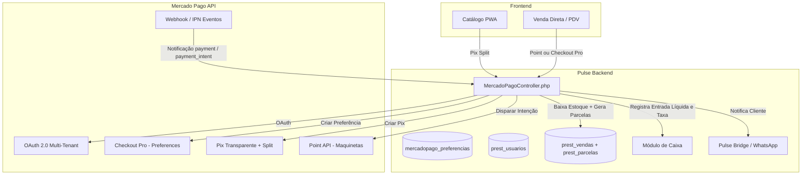
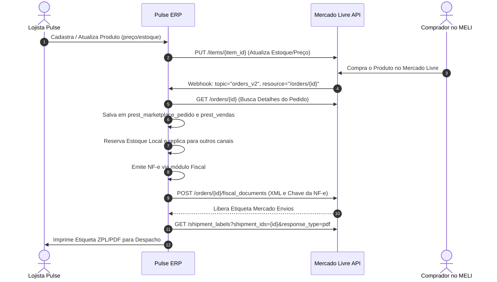
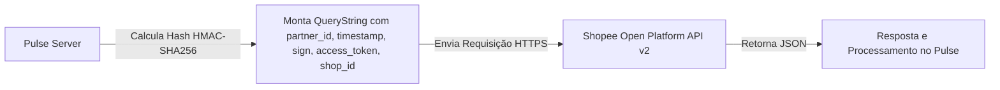
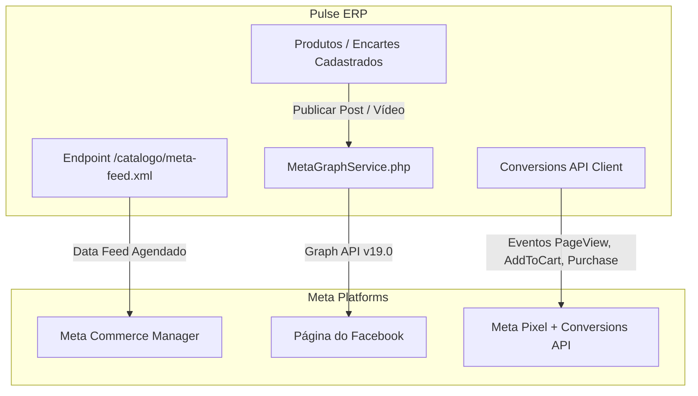
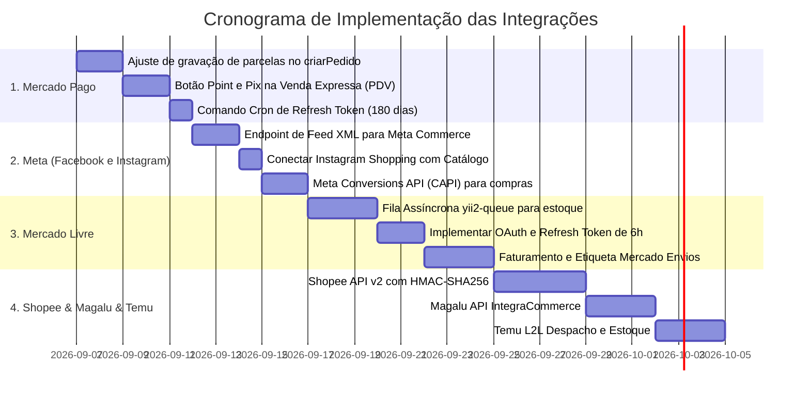

# 🚀 Guia Definitivo de Integrações: Marketplaces, Gateways e Redes Sociais
## Sistema Pulse ERP / Pulse Plus

> **Data de Atualização:** Setembro de 2026  
> **Status Geral do Projeto:** Arquitetura multi-tenant híbrida (PostgreSQL / MySQL), módulos integrados de Vendas, PDV/Venda Expressa, Caixa, Catálogo PWA, Mídia/Vídeos e Fiscal (NF-e).

---

## 📊 Matriz Geral de Prontidão das Integrações

| Canal | Tipo | Nível Atual | Backend / Models | Frontend / UI | O que falta principalmente |
| :--- | :--- | :---: | :--- | :--- | :--- |
| **1. Mercado Pago** | Gateway / Pagamentos | **85% (Quase Pronto)** | `MercadoPagoController`, `mercadopago_preferencias`, `prest_usuarios` | Catálogo PWA, Venda Direta | Correção de parcelas em `prest_parcelas`, botão no PDV Venda Expressa, Cron de refresh token. |
| **2. Mercado Livre** | Marketplace | **40% (Estrutura Base)** | `MercadoLivreService`, `prest_marketplace_*` | Telas de Configuração | OAuth refresh token de 6h, mapeamento de atributos obrigatórios, envio de NF-e e etiquetas ZPL/PDF. |
| **3. Shopee** | Marketplace | **35% (Estrutura Base)** | `ShopeeService`, `ShopeeWebhookHandler` | Telas de Configuração | Assinatura HMAC-SHA256 completa na API v2, upload de fotos para CDN da Shopee, webhook de status. |
| **4. Magalu** | Marketplace | **30% (Estrutura Base)** | `MagaluService` | Telas de Configuração | Conexão API IntegraCommerce, envio de catálogo XML/JSON, faturamento e etiqueta Magalu Entregas. |
| **5. Temu** | Marketplace L2L | **25% (Estrutura Base)** | `TemuService` | Telas de Configuração | Open Platform L2L Brasil, assinatura de requisições, atualização de estoque local e despacho. |
| **6. Facebook** | Meta Commerce / Graph | **50% (Mídia Pronta)** | `MetaGraphService`, `SocialAccount`, `SocialPost` | Painel Social | Catálogo XML (Feed de Produtos Meta), Meta Conversions API (CAPI) server-side. |
| **7. Instagram** | Shopping / Direct / Reels | **50% (Mídia Pronta)** | `MetaGraphService`, `PublishSocialMediaJob` | Painel Social | Vínculo Instagram Shopping (Sacolinha), Webhook do Direct Messaging API para checkout automático. |

---

## 1. 💳 INTEGRAÇÃO MERCADO PAGO (PRIORITÁRIO)

O **Mercado Pago** é a espinha dorsal financeira do Pulse, atuando tanto no **Catálogo PWA**, na **Venda Direta/Expressa**, no **Pix Transparente com Split** e nas maquinetas físicas **Mercado Pago Point**.



---

### 1.1 O que JÁ ESTÁ IMPLEMENTADO no Projeto

1. **OAuth 2.0 Multi-Tenant Completo:**
   * Arquivo: `modules/api/controllers/MercadoPagoController.php` (linhas 130-310).
   * Endpoints:
     * `GET /api/mercado-pago/connect-url`: Gera a URL segura oficial do Mercado Pago com `client_id`, `state` criptografado e `redirect_uri`.
     * `GET /api/mercado-pago/oauth-callback`: Recebe o `code` de autorização, realiza a troca por tokens (`access_token`, `refresh_token`, `public_key`, `user_id`, `expires_in`) e salva na tabela `prest_usuarios` do tenant correspondente.
2. **Checkout Pro com Workaround Anti-Falhas:**
   * Endpoint: `POST /api/mercado-pago/criar-preferencia`.
   * Geração de preferências de checkout com `items`, `payer`, `back_urls` (sucesso, pendente, falha) e `notification_url`.
   * Implementação via **Guzzle HTTP Client nativo** para contornar problemas conhecidos de serialização de cidade/endereço da SDK PHP oficial do Mercado Pago.
   * Registro do histórico na tabela `mercadopago_preferencias`.
3. **Pix Transparente com Split de Comissão da Plataforma:**
   * Endpoint: `POST /api/mercado-pago/pix-split`.
   * Criação do Pix via API v1 com divisão de valores (`application_fee` da plataforma retido na fonte e valor líquido direcionado à conta do lojista).
   * Retorno do QR Code Base64 e do código Pix Copia e Cola diretamente na tela do cliente.
4. **Integração com Maquinetas Físicas (Point API):**
   * Endpoints:
     * `POST /api/mercado-pago/criar-pagamento-point`: Dispara a cobrança direto no visor da maquininha (Point Pro 2, Point Smart).
     * `GET /api/mercado-pago/consultar-pagamento-point`: Polling de status do pagamento.
     * `POST /api/mercado-pago/cancelar-pagamento-point`: Cancela a cobrança na maquininha.
     * `POST /api/mercado-pago/registrar-dispositivo`: Salva o número de série da maquineta vinculada ao vendedor.
5. **Webhook Unificado com Ações Automatizadas:**
   * Endpoint: `POST /api/mercado-pago/webhook`.
   * Validação da assinatura criptográfica `x-signature` para evitar fraudes.
   * Identificação dinâmica do vendedor pelo `user_id` da notificação ou pelo `external_reference`.
   * Quando o pagamento é aprovado (`approved`):
     * Atualiza o status da venda para quitada.
     * Decrementa o estoque real em `prest_produtos`.
     * Registra a entrada financeira no Caixa aberto (`CaixaHelper::registrarEntradaVenda`).
     * Registra a saída da taxa/split no Caixa para conciliação contábil exata.
     * Dispara notificação automática no WhatsApp do comprador via **Evolution API / Pulse Bridge**.

---

### 1.2 O que FALTA no Mercado Pago (Gaps Críticos & Correções)

#### 🔴 Gap 1: Ausência de Gravação de Parcelas no Método `criarPedido`
* **Problema:** No arquivo `MercadoPagoController.php` (linhas 1132-1175), o método `criarPedido()` insere o registro na tabela `prest_vendas` e os itens na `prest_venda_itens` usando SQL bruto (`INSERT INTO`), mas **não gera nenhum registro na tabela `prest_parcelas`**.
* **Impacto:** O financeiro e os relatórios de contas a receber ficam sem parcelas registradas para essas vendas, exigindo que o webhook tente recriá-las emergencialmente no método `liberarPedido`.
* **Solução Técnica:** No método `criarPedido()`, imediatamente após o commit dos itens, chamar o método do modelo de domínio:
```php
$vendaModel = \app\modules\vendas\models\Venda::findOne($vendaId);
if ($vendaModel) {
    $vendaModel->gerarParcelas(
        $dados['forma_pagamento_id'],
        $dados['data_primeiro_vencimento'] ?? date('Y-m-d'),
        $dados['intervalo_dias_parcelas'] ?? 30,
        true // true = quitar automaticamente se o pagamento já estiver confirmado
    );
}
```

#### 🔴 Gap 2: Tratamento de Base URL do Webhook em Ambientes com Subpastas
* **Problema:** Em algumas instalações locais ou VPS (`/pulse/web/` ou proxy reverso), a URL enviada ao Mercado Pago pode ser gerada como `https://dominio.com/api/mercado-pago/webhook` em vez de contemplar o `baseUrl` correto da aplicação.
* **Solução Técnica:** Padronizar a criação da `notification_url` utilizando:
```php
$notificationUrl = Yii::$app->request->hostInfo . Yii::$app->request->baseUrl . '/api/mercado-pago/webhook';
```

#### 🔴 Gap 3: Falta do Botão "Mercado Pago Point / Pix" na Venda Expressa (PDV)
* **Problema:** A tela de Venda Expressa (`modules/vendas/views/venda-expressa/index.php`) atualmente suporta Dinheiro, Cartão Local, Boleto/Fiado, mas não possui o botão nativo para acionar a Maquininha Point do operador ou abrir o QR Code Pix na tela para o cliente escanear.
* **Solução Técnica:** Adicionar o botão "Mercado Pago Point / Pix" no modal de fechamento da Venda Expressa e conectar com os endpoints `/api/mercado-pago/criar-pagamento-point` e `/api/mercado-pago/pix-split`.

#### 🔴 Gap 4: Cron Job de Renovação Automática do OAuth Token (Refresh Token)
* **Problema:** O token de acesso OAuth do Mercado Pago expira após 180 dias. Sem renovação periódica, o vendedor deixa de receber pagamentos silenciosamente após esse prazo.
* **Solução Técnica:** Criar o comando console `commands/MercadoPagoController.php` com ação `actionRefreshToken()`:
```bash
# Executado diariamente via Cron
0 3 * * * /usr/bin/php /srv/http/pulse/yii mercadopago/refresh-tokens
```
O comando busca todos os registros de `prest_usuarios` onde `mercadopago_token_expires_at` está a menos de 15 dias do vencimento e executa `POST https://api.mercadopago.com/oauth/token` com `grant_type=refresh_token`.

#### 🔴 Gap 5: Variáveis de Ambiente Globais no `.env`
* Assegurar que as credenciais do aplicativo desenvolvedor estejam registradas em todas as VPS:
```env
MP_APP_CLIENT_ID=SEU_APP_ID_MERCADOPAGO
MP_APP_CLIENT_SECRET=SEU_CLIENT_SECRET_MERCADOPAGO
MP_WEBHOOK_SECRET=SEU_WEBHOOK_SIGNATURE_SECRET
MP_PLATFORM_FEE_PERCENT=1.5
```

---

### 1.3 Passo a Passo para Ativação e Operação em Produção (Mercado Pago)

1. **Passo 1 — Cadastro da Aplicação no Mercado Pago Developers:**
   * Acesse [mercadopago.com.br/developers](https://www.mercadopago.com.br/developers/) com a conta matriz do Pulse.
   * Crie a aplicação chamada **Pulse ERP** com tipo "Pagamentos no Mercado Pago".
   * Configure as **URLs de Redirecionamento (Redirect URI)**:
     * Produção: `https://catalogos.oncode.app.br/api/mercado-pago/oauth-callback`
     * Localhost: `http://localhost/pulse/web/api/mercado-pago/oauth-callback`
2. **Passo 2 — Configuração do Webhook IPN no Portal do MP:**
   * Cadastre a URL de Webhooks: `https://catalogos.oncode.app.br/api/mercado-pago/webhook`.
   * Habilite os eventos: `Pagamentos (Payments)` e `Intenções de Pagamento (Payment Intents)`.
   * Copie a **Chave Secreta de Assinatura (Secret)** para o `.env` (`MP_WEBHOOK_SECRET`).
3. **Passo 3 — Conexão da Conta do Lojista (Multi-Tenant):**
   * No painel do Pulse, acesse **Configurações > Pagamentos > Mercado Pago**.
   * Clique no botão **"Conectar com Mercado Pago"**.
   * O lojista fará login na conta dele e autorizará a aplicação Pulse.
   * O sistema salva automaticamente o `access_token` e `public_key` exclusivos daquele lojista.
4. **Passo 4 — Vínculo da Maquininha Point (Opcional para lojas físicas):**
   * O vendedor liga a maquineta Point (conectada no Wi-Fi/4G).
   * No Pulse, insere o número de série da maquineta (impresso atrás do aparelho).
   * O Pulse registra o dispositivo via `POST /api/mercado-pago/registrar-dispositivo`.
5. **Passo 5 — Teste de Pagamento e Homologação:**
   * Realize um Pix de R$ 1,00 ou passe R$ 1,00 no cartão.
   * Verifique o log em `runtime/logs/mercadopago.log`.
   * Confirme se o estoque baixou, a venda quitou, o Caixa registrou a entrada líquida e o WhatsApp disparou.

---

## 2. 🛍️ INTEGRAÇÃO MERCADO LIVRE (MELI)

O **Mercado Livre** é o maior marketplace da América Latina. Diferente do gateway Mercado Pago, a integração com o Mercado Livre engloba: **Catálogo/Anúncios**, **Estoque Multicanal**, **Importação de Pedidos**, **Perguntas/Pós-Venda**, **Faturamento Fiscal (NF-e)** e **Mercado Envios**.



---

### 2.1 O que JÁ TEM no Projeto

* **Tabelas no PostgreSQL (`sql/postgres/013_create_marketplace_tables.sql` e `014`):**
  * `prest_marketplace_config`: Armazena `marketplace = 'MERCADO_LIVRE'`, `client_id`, `client_secret`, `access_token`, `refresh_token`, `seller_id`, `expires_in`.
  * `prest_marketplace_produto`: Guarda o vínculo entre o `produto_id` local e o `item_id` externo do MELI (ex: `MLB123456789`).
  * `prest_marketplace_pedido` e `prest_marketplace_pedido_item`: Armazena o pedido bruto importado.
  * `prest_marketplace_sync_log`: Registra histórico de sincronizações de estoque e preço.
* **Componentes Backend:**
  * `modules/marketplace/components/MercadoLivreService.php`: Esqueleto do serviço estendendo `MarketplaceService`.
  * `modules/marketplace/components/MercadoLivreWebhookHandler.php`: Roteador básico para receber notificações do webhook do MELI.

---

### 2.2 O que FALTA no Mercado Livre

1. **Job de Renovação Automática do Token OAuth (Validade de apenas 6 Horas):**
   * Os tokens do Mercado Livre expiram a cada 21.600 segundos (6 horas).
   * Falta um worker que execute a renovação antes da expiração via `POST https://api.mercadolibre.com/oauth/token` com `grant_type=refresh_token`.
2. **Mapeamento de Categorias e Atributos Obrigatórios:**
   * O MELI rejeita anúncios sem atributos obrigatórios específicos da categoria (ex: em calçados exige `GENDER`, `SIZE`, `COLOR`; em eletrônicos exige `VOLTAGE`, `BRAND`, `MODEL`).
   * Falta a interface para mapear a categoria do Pulse com a categoria do MELI e preencher atributos dinâmicos.
3. **Sincronização de Estoque Assíncrona via Fila (Queue):**
   * O `MarketplaceSyncManager` atualmente dispara sincronização de forma síncrona. Deve ser enfileirado no `yii2-queue`.
4. **Envio da NF-e para Liberação de Etiquetas do Mercado Envios:**
   * Emissão da NF-e e chamada a `POST /orders/{order_id}/fiscal_documents` com a chave de 44 dígitos e o XML Danfe codificado em Base64.
5. **Download e Impressão de Etiquetas do Mercado Envios:**
   * Implementação do endpoint de etiquetas: `GET /shipment_labels?shipment_ids={shipment_id}&response_type=pdf` (ou `response_type=zpl2` para impressoras térmicas Zebra).

---

### 2.3 Passo a Passo de Implementação (Mercado Livre)

1. **Passo 1 — Criar Aplicativo no Mercado Livre Developers:**
   * Acesse [developers.mercadolivre.com.br](https://developers.mercadolivre.com.br/) e faça login.
   * Crie uma aplicação: Nome **Pulse Marketplace Hub**.
   * Configure os escopos: `read`, `write`, `offline_access`.
   * Configure as URLs de Callback e Notificação:
     * Redirect URI: `https://catalogos.oncode.app.br/marketplace/oauth/callback?channel=mercado-livre`
     * Notifications Callback URL: `https://catalogos.oncode.app.br/marketplace/webhook/receive?channel=mercado-livre`
   * Anote o `App ID` e a `Secret Key`.
2. **Passo 2 — Fluxo de Autorização do Seller:**
   * O seller clica em **"Conectar Mercado Livre"** no Pulse.
   * O Pulse redireciona para:
     `https://auth.mercadolivre.com.br/authorization?response_type=code&client_id={APP_ID}&redirect_uri={REDIRECT_URI}`
   * No callback, o Pulse captura o `code` e faz o POST:
     ```http
     POST https://api.mercadolibre.com/oauth/token
     Content-Type: application/x-www-form-urlencoded

     grant_type=authorization_code&client_id={APP_ID}&client_secret={SECRET}&code={CODE}&redirect_uri={REDIRECT_URI}
     ```
   * Salva `access_token`, `refresh_token`, `user_id` do seller e `expires_in` na `prest_marketplace_config`.
3. **Passo 3 — Publicação de Anúncios e Vínculo de SKUs:**
   * Para vincular produtos existentes: faz a busca por SKU (`GET /users/{user_id}/items/search?seller_sku={SKU}`) e salva na tabela `prest_marketplace_produto`.
   * Para novos anúncios: envia payload para `POST /items`:
     ```json
     {
       "title": "Camisa Polo Slim Fit Algodão",
       "category_id": "MLB1055",
       "price": 89.90,
       "currency_id": "BRL",
       "available_quantity": 15,
       "buying_mode": "buy_it_now",
       "listing_type_id": "gold_special",
       "condition": "new",
       "pictures": [{"source": "https://meusite.com.br/uploads/camisa.jpg"}],
       "attributes": [
         {"id": "BRAND", "value_name": "Minha Marca"},
         {"id": "ITEM_CONDITION", "value_name": "Novo"}
       ]
     }
     ```
4. **Passo 4 — Sincronização de Estoque Contínua:**
   * No `afterSave` do `Produto.php`:
     ```php
     Yii::$app->queue->push(new \app\modules\marketplace\jobs\SyncEstoqueJob([
         'produtoId' => $this->id,
         'quantidade' => $this->estoque_atual
     ]));
     ```
   * O job executa:
     `PUT /items/{item_id}` com `{"available_quantity": $quantidade}`.
5. **Passo 5 — Processamento de Pedido e Faturamento:**
   * Webhook recebe `{"resource": "/orders/20000012345", "topic": "orders_v2"}`.
   * O Pulse busca os dados do comprador, cria a venda no ERP e decrementa o estoque local.
   * Ao faturar a nota, envia o XML e chave para `/orders/{order_id}/fiscal_documents`.
   * Faz o download do PDF da etiqueta e disponibiliza o botão "Imprimir Etiqueta" no painel de expedição.

---

## 3. 🛍️ INTEGRAÇÃO SHOPEE (API v2)

A **Shopee** opera através da **Shopee Open Platform API v2**. Diferente da maioria das APIs REST convencionais, a Shopee exige que **toda e qualquer requisição** seja assinada digitalmente com um hash criptográfico `HMAC-SHA256` gerado com a chave do desenvolvedor (`partner_key`).



---

### 3.1 O que JÁ TEM no Projeto

* `modules/marketplace/components/ShopeeService.php`:
  * Função `generateSignature(string $path, int $timestamp, ?string $accessToken = null, ?string $shopId = null)` já calcula o hash `HMAC-SHA256` conforme o padrão da Shopee.
  * Estrutura básica de classes DTO para mapeamento de pedidos (`MarketplaceOrderDTO`, `MarketplaceOrderItemDTO`).
* `modules/marketplace/components/ShopeeWebhookHandler.php`:
  * Estrutura para receber os eventos da Shopee.

---

### 3.2 O que FALTA na Shopee

1. **Upload Prévio de Imagens para a CDN da Shopee:**
   * A Shopee não aceita URLs externas arbitrárias na criação de produtos. Antes de publicar o produto, todas as imagens devem ser enviadas para o endpoint `/api/v2/media_space/upload_image` para obter os identificadores `image_id`.
2. **Atualização de Estoque na API v2:**
   * Implementação da rota `/api/v2/product/update_stock` com estrutura de localização/armazém:
     ```json
     {
       "item_id": 1234567,
       "stock_list": [
         {"model_id": 0, "normal_stock": 25}
       ]
     }
     ```
3. **Envio de Fatura/NF-e (`set_invoice_info`):**
   * Chamada para `/api/v2/order/set_invoice_info` informando número da nota fiscal, série e chave de acesso para liberar a impressão de etiqueta do Shopee Envios.
4. **Geração e Download de Etiquetas de Envio:**
   * Endpoints `/api/v2/logistics/create_shipping_document` e `/api/v2/logistics/get_shipping_document_result`.

---

### 3.3 Passo a Passo de Implementação (Shopee)

1. **Passo 1 — Cadastro na Shopee Open Platform:**
   * Acesse [open.shopee.com](https://open.shopee.com/) e crie uma conta de desenvolvedor.
   * Crie uma aplicação: Tipo "App In-House" (se for exclusivo para lojas próprias) ou "Cross-Border / Custom App" para múltiplos sellers.
   * Obtenha o `Partner ID` e a `Partner Key`.
2. **Passo 2 — Autorização da Loja (OAuth Shopee):**
   * Gere o link de consentimento assinado:
     ```php
     $path = '/api/v2/shop/auth_partner';
     $timestamp = time();
     $sign = hash_hmac('sha256', $partnerId . $path . $timestamp, $partnerKey);
     $url = "https://partner.shopeemobile.com{$path}?partner_id={$partnerId}&timestamp={$timestamp}&sign={$sign}&redirect={$redirectUrl}";
     ```
   * O lojista autoriza a loja e o callback recebe `code` e `shop_id`.
   * Troque o `code` pelo `access_token` e `refresh_token` (válido por 4 horas com refresh válido por 30 dias) via `/api/v2/auth/token/get`.
3. **Passo 3 — Sincronização de Produtos e Estoque:**
   * Execute o upload de imagens para obter os `image_id`s.
   * Cadastre o produto via `/api/v2/product/add_item` com atributos obrigatórios, peso e dimensões.
   * Conecte o `afterSave` do estoque com a rota `/api/v2/product/update_stock`.
4. **Passo 4 — Processamento de Pedidos e Logística:**
   * Configure o Webhook na Shopee para receber o evento `ORDER_STATUS_UPDATE`.
   * Quando o pedido estiver com status `READY_TO_SHIP`:
     * O Pulse emite a NF-e.
     * Envia os dados fiscais via `/api/v2/order/set_invoice_info`.
     * Solicita o documento de rastreio via `/api/v2/logistics/create_shipping_document`.
     * Baixa a etiqueta em PDF/ZPL via `/api/v2/logistics/get_shipping_document_result`.

---

## 4. 🛒 INTEGRAÇÃO MAGAZINE LUIZA (MAGALU)

O **Magazine Luiza (Magalu)** opera com integração através da plataforma **IntegraCommerce / LuizaLabs API**, utilizando autenticação baseada em API Key ou Token Bearer por seller.

---

### 4.1 O que JÁ TEM e o que FALTA no Magalu

* **O que já tem:**
  * Componente `modules/marketplace/components/MagaluService.php`.
  * Tabelas de pedidos e mapeamento de produtos prontas no PostgreSQL.
* **O que falta:**
  * Implementação real das chamadas REST no `MagaluService.php` (atualmente retorna stubs estáticos).
  * Tratamento de catálogo (`POST /v1/products`), estoque (`PUT /v1/products/{sku}/stock`) e preços (`PUT /v1/products/{sku}/price`).
  * Rotina de importação de pedidos aprovados (`GET /v1/orders/status/approved`).
  * Envio de NF-e (`POST /v1/orders/{id}/invoice`) e download de etiqueta Magalu Entregas.

---

### 4.2 Passo a Passo de Implementação (Magalu)

1. **Passo 1 — Credenciamento de Seller e Token de API:**
   * Acesse o [Portal do Seller Magalu](https://seller.magazineluiza.com.br/) ou [developers.magalu.com](https://developers.magalu.com/).
   * Acesse **Integrações > Chaves de API** e gere o `API Token` e o identificador do Seller.
   * Cadastre no Pulse em **Marketplaces > Configurações > Magalu**.
2. **Passo 2 — Sincronização de Produtos:**
   * O Magalu exige envio de dados completos de frete: peso líquido, peso bruto, altura, largura e profundidade em centímetros, além de EAN/GTIN e NCM.
   * Envio de lote de produtos para `POST https://api.magazineluiza.com.br/v1/products`.
3. **Passo 3 — Sincronização em Tempo Real de Preço e Estoque:**
   * Ao alterar o estoque no Pulse:
     ```http
     PUT https://api.magazineluiza.com.br/v1/products/{SKU}/stock
     Authorization: Bearer {SEU_TOKEN}
     Content-Type: application/json

     {
       "quantity": 30
     }
     ```
4. **Passo 4 — Fila de Pedidos e Faturamento:**
   * Consulta periódica (polling a cada 3 minutos) ou webhook de pedidos no status `approved`.
   * Ao emitir a NF-e no Pulse, envia o faturamento:
     ```http
     POST https://api.magazineluiza.com.br/v1/orders/{ORDER_ID}/invoice
     Authorization: Bearer {SEU_TOKEN}
     Content-Type: application/json

     {
       "number": "000123",
       "series": "1",
       "key": "35260900000000000000550010000001231000001234",
       "issued_date": "2026-09-06T10:00:00-03:00",
       "xml": "PD94bWwgdmVyc2lvbj0..."
     }
     ```
   * O Magalu valida a nota e libera a etiqueta de envio em PDF via `GET /v1/orders/{ORDER_ID}/shipping-label`.

---

## 5. 📦 INTEGRAÇÃO TEMU (LOCAL-TO-LOCAL BRASIL)

A **Temu** iniciou sua operação oficial com vendedores nacionais no Brasil no modelo **Local-to-Local (L2L)**, onde o estoque fica armazenado fisicamente em território brasileiro e a expedição ocorre via transportadoras locais homologadas pela Temu (Correios, Jadlog, Total Express, etc.).

---

### 5.1 O que JÁ TEM e o que FALTA na Temu

* **O que já tem:**
  * Componente inicial `modules/marketplace/components/TemuService.php`.
* **O que falta:**
  * Autenticação completa da **Temu Open Platform (L2L)**: Assinatura de requests com `App Key`, `App Secret`, `timestamp` e assinatura `sign`.
  * Sincronização de estoque no armazém nacional (`POST /bg/goods/local/inventory/update`).
  * Leitura e reserva de pedidos pendentes de expedição (`POST /bg/order/local/list`).
  * Envio de dados fiscais (Danfe/NF-e) e confirmação de despacho dentro do SLA estrito de 24 horas (`POST /bg/order/local/shipment/confirm`).

---

### 5.2 Passo a Passo de Implementação (Temu)

1. **Passo 1 — Cadastro no Temu Seller Central Brasil:**
   * Acesse [seller.temu.com](https://seller.temu.com/) na modalidade **Vendedor Local Brasil (CNPJ)**.
   * Cadastre a empresa, dados bancários e endereço de expedição do centro de distribuição/loja.
2. **Passo 2 — Obtenção das Chaves na Temu Open Platform:**
   * Acesse o portal de desenvolvedores da Temu e vincule sua loja.
   * Obtenha o `app_key` e `app_secret`.
3. **Passo 3 — Sincronização de Inventário Local:**
   * A Temu exige controle rigoroso de estoque para evitar penalizações de SLA.
   * Atualização de estoque via endpoint L2L:
     ```http
     POST https://open-api.temu.com/bg/goods/local/inventory/update
     Content-Type: application/json

     {
       "app_key": "SEU_APP_KEY",
       "timestamp": 1788680000,
       "sign": "HASH_GERADO",
       "goods_id": 987654321,
       "sku_id": 123456,
       "quantity": 50
     }
     ```
4. **Passo 4 — Expedição Rápida e Faturamento:**
   * A Temu exige envio em até 24h a 48h úteis. O Pulse deve agendar uma tarefa Cron a cada 5 minutos buscando novos pedidos.
   * Imediatamente ao receber o pedido:
     * O Pulse emite a NF-e pelo módulo fiscal.
     * Envia o XML e código de rastreamento para a rota `/bg/order/local/shipment/confirm`.
     * Imprime a etiqueta térmica padrão no formato 100x150mm.

---

## 6. 🌐 INTEGRAÇÃO FACEBOOK (META COMMERCE & CONVERSIONS API)

A integração com o **Facebook** abrange duas frentes vitais:
1. **Publicação Orgânica de Conteúdo:** Postagem de encartes, produtos e vídeos diretamente na Página do Facebook da loja.
2. **Meta Commerce Manager & Conversions API (CAPI):** Alimentação do Catálogo de Produtos da Meta para anúncios dinâmicos de retargeting e rastreamento de conversão server-side sem perdas causadas por ad-blockers.



---

### 6.1 O que JÁ TEM no Projeto

* **Serviço Central Desacoplado (`components/MetaGraphService.php`):**
  * Método `exchangeForLongLivedUserToken()`: Converte tokens de curta duração (2 horas) em **tokens de longa duração (60 dias)**.
  * Método `getConnectedPagesAndInstagramAccounts()`: Lista todas as Páginas do Facebook administradas pelo usuário e localiza automaticamente a conta do Instagram Business vinculada.
  * Método `publishToFacebookPage()`: Publica fotos e vídeos/Reels diretamente no feed da Página do Facebook com legendas formatadas.
* **Modelos e Tabelas no Banco:**
  * `models/SocialAccount.php`: Armazena tokens da página, IDs e status de conexão.
  * `models/SocialPost.php`: Histórico de publicações, status (PENDENTE, PROCESSANDO, PUBLICADO, ERRO) e retorno da Meta.
  * `jobs/PublishSocialMediaJob.php`: Fila assíncrona para não travar a aplicação durante o upload de mídia para os servidores da Meta.
* **Controller Administrativo:**
  * `controllers/SocialIntegrationController.php`: Painel de conexão OAuth e agendamento de posts.

---

### 6.2 O que FALTA no Facebook

#### 1. Gerador de Catálogo de Produtos XML/RSS para o Meta Commerce Manager
* **O que é:** Um feed público no formato Google Shopping / Meta Catalog XML gerado pelo Pulse (ex: `https://catalogos.oncode.app.br/catalogo/feed-meta.xml?usuario_id={ID}`).
* **Campos Obrigatórios da Meta:**
  * `<id>`: SKU ou ID do produto.
  * `<title>`: Nome do produto.
  * `<description>`: Descrição detalhada.
  * `<availability>`: `in stock` ou `out of stock`.
  * `<condition>`: `new`.
  * `<price>`: Ex: `89.90 BRL`.
  * `<link>`: URL direta do produto no Catálogo PWA do Pulse.
  * `<image_link>`: URL pública da imagem em alta resolução.
  * `<brand>`: Marca do produto.
* **Benefício:** O Meta Business Suite baixa esse XML diariamente e mantém os produtos sempre atualizados para anúncios e lojas no Facebook e Instagram.

#### 2. Meta Conversions API (CAPI) Server-Side
* **O que é:** Envio de eventos diretamente do PHP do Pulse para `https://graph.facebook.com/v19.0/{PIXEL_ID}/events`.
* **Eventos a disparar:**
  * `ViewContent`: Quando um cliente abre um encarte ou página de produto no PWA.
  * `AddToCart`: Quando adiciona ao carrinho.
  * `InitiateCheckout`: Quando clica em fechar pedido.
  * `Purchase`: Quando o pagamento é confirmado no Mercado Pago (Webhook) ou na Venda Expressa.

---

### 6.3 Passo a Passo de Implementação (Facebook)

1. **Passo 1 — Criação do App no Meta for Developers:**
   * Acesse [developers.facebook.com](https://developers.facebook.com/).
   * Crie um App do tipo **Empresarial (Business)**.
   * Adicione os produtos: **Facebook Login for Business**, **Graph API** e **Webhooks**.
   * Adicione as permissões: `pages_show_list`, `pages_read_engagement`, `pages_manage_posts`, `catalog_management`.
2. **Passo 2 — Configuração no Pulse (`config/params.php` e `.env`):**
   ```env
   META_APP_ID=SEU_META_APP_ID
   META_APP_SECRET=SEU_META_APP_SECRET
   META_API_VERSION=v19.0
   ```
3. **Passo 3 — Criação do Endpoint de Feed XML:**
   * Criar a action `actionFeedMeta()` em `modules/catalogo/controllers/FeedController.php`.
   * Gerar o XML formatado com os produtos ativos e com estoque > 0.
4. **Passo 4 — Configuração do Catálogo no Meta Commerce Manager:**
   * Acesse [commerce.facebook.com](https://commerce.facebook.com/) > **Catálogos**.
   * Escolha **Adicionar Produtos > Feed de Dados (Data Feed)**.
   * Insira a URL do feed do Pulse e defina a atualização para "Diária" ou "A cada hora".
5. **Passo 5 — Ativação da Conversions API (CAPI):**
   * No Gerenciador de Eventos da Meta, gere o **Token de Acesso da Conversions API**.
   * Conecte no controller do Catálogo para enviar o payload de `Purchase` quando a venda for concluída.

---

## 7. 📸 INTEGRAÇÃO INSTAGRAM (SHOPPING, DIRECT API & REELS)

A integração com o **Instagram** potencializa as vendas diretas através de **Reels**, **Posts com Sacolinha (Instagram Shopping)** e **Atendimento Automatizado via Direct Message**.

---

### 7.1 O que JÁ TEM no Projeto

* **Arquitetura de Publicação de Mídia em Dois Passos (Containers Meta):**
  * Implementada no `components/MetaGraphService.php`:
    * `createInstagramMediaContainer()`: Envia a URL pública do vídeo/Reels ou da imagem para a Meta e recebe o `creation_id`.
    * `checkInstagramContainerStatus()`: Faz o polling para acompanhar o processamento assíncrono do vídeo na nuvem da Meta até que retorne `status_code = 'FINISHED'`.
    * `publishInstagramContainer()`: Publica o container no feed/Reels do Instagram Business.
* **Fila Assíncrona de Publicação:**
  * O job `PublishSocialMediaJob.php` gerencia o tempo de renderização e publicação sem travar a interface do lojista.

---

### 7.2 O que FALTA no Instagram

#### 1. Instagram Shopping (Sacolinha de Produtos)
* **O que é:** Marcar produtos nas fotos e Reels publicados.
* **Como ativar:** Exige que a Conta do Instagram Business esteja vinculada ao **Catálogo do Meta Commerce Manager** configurado no passo anterior (Item 6).
* **Parâmetro na API:** Na chamada de criação de container `/media`, passar o parâmetro:
  ```json
  "product_tags": [
    {"product_id": "SKU_OU_ID_NO_CATALOGO", "x": 0.5, "y": 0.6}
  ]
  ```

#### 2. Instagram Messaging API (Chatbot e Venda no Direct)
* **O que é:** Responder automaticamente mensagens diretas de clientes no Instagram com cards de produtos, fotos e botões de checkout com link ou chave Pix.
* **O que falta:**
  * Cadastrar o webhook do Instagram Messaging para o evento `messages`.
  * Ao receber uma mensagem como *"Preço da camisa"* ou *"Quero comprar"*, o bot do Pulse consulta a base de produtos e responde com:
    1. Imagem do produto.
    2. Preço e descrição.
    3. Link curto do Catálogo PWA ou Código Pix Copia e Cola para pagamento imediato.

#### 3. Integração Automática com o Módulo de Vídeos de Encarte do Pulse
* O Pulse possui o `AudioProcessorService.php` e renderizadores de vídeo promocional. Falta conectar a conclusão do vídeo diretamente com a fila `PublishSocialMediaJob` para que, ao finalizar a geração de um vídeo de ofertas, o lojista possa clicar em *"Publicar agora no Instagram Reels e Facebook"*.

---

### 7.3 Passo a Passo de Implementação (Instagram)

1. **Passo 1 — Transformar o Instagram em Conta Profissional:**
   * No app do Instagram: **Configurações > Tipo de Conta > Mudar para Conta Profissional (Empresa/Criador)**.
   * Vincule a conta à **Página do Facebook** da empresa.
2. **Passo 2 — Conectar o Instagram ao Pulse:**
   * No Pulse, acesse **Redes Sociais > Conectar Meta**.
   * Ao autorizar a Página do Facebook, o `MetaGraphService` identifica automaticamente o `instagram_business_account_id` e armazena na `models/SocialAccount.php`.
3. **Passo 3 — Ativação do Instagram Shopping:**
   * No Meta Commerce Manager, vá em **Configurações > Canais de Venda**.
   * Conecte o perfil do Instagram Business ao Catálogo alimentado pelo feed do Pulse.
   * Aguarde a análise da Meta (costuma aprovar em 24h a 48h).
   * Uma vez aprovado, a "Sacolinha" fica ativa no perfil e as postagens podem receber tags de produtos.
4. **Passo 4 — Webhook do Direct Messaging:**
   * No App Meta, habilite a permissão `instagram_manage_messages`.
   * Configure a URL de Webhook: `https://catalogos.oncode.app.br/social-integration/instagram-webhook`.
   * Implemente a lógica de resposta automática com ofertas e link de checkout.
5. **Passo 5 — Teste de Publicação de Reels:**
   * Crie um vídeo no módulo de áudio/vídeo do Pulse.
   * Clique em "Publicar no Instagram".
   * Acompanhe os logs em `runtime/logs/social_media.log`.
   * O Reels aparecerá publicado no perfil com a legenda configurada e hashtags de promoção.

---

## 8. 🛠️ Plano de Ação e Roadmap Sequencial Recomendado



---

## 9. 📁 Arquivos do Projeto Envolvidos em Cada Integração

| Canal | Arquivos Chave no Repositório |
| :--- | :--- |
| **Mercado Pago** | `modules/api/controllers/MercadoPagoController.php`<br>`modules/vendas/models/Venda.php`<br>`modules/vendas/models/Parcela.php`<br>`modules/vendas/views/venda-expressa/index.php`<br>`modules/caixa/helpers/CaixaHelper.php` |
| **Mercado Livre** | `modules/marketplace/components/MercadoLivreService.php`<br>`modules/marketplace/components/MercadoLivreWebhookHandler.php`<br>`modules/marketplace/models/MarketplaceConfig.php`<br>`modules/marketplace/models/MarketplaceProduto.php`<br>`components/nfe/NfeManager.php` |
| **Shopee** | `modules/marketplace/components/ShopeeService.php`<br>`modules/marketplace/components/ShopeeWebhookHandler.php`<br>`modules/marketplace/dto/MarketplaceOrderDTO.php` |
| **Magalu** | `modules/marketplace/components/MagaluService.php` |
| **Temu** | `modules/marketplace/components/TemuService.php` |
| **Facebook & Instagram** | `components/MetaGraphService.php`<br>`controllers/SocialIntegrationController.php`<br>`models/SocialAccount.php`<br>`models/SocialPost.php`<br>`jobs/PublishSocialMediaJob.php`<br>`modules/vendas/services/AudioProcessorService.php` |

---
*Documento gerado e verificado tecnicamente no repositório `/srv/http/pulse`.*
