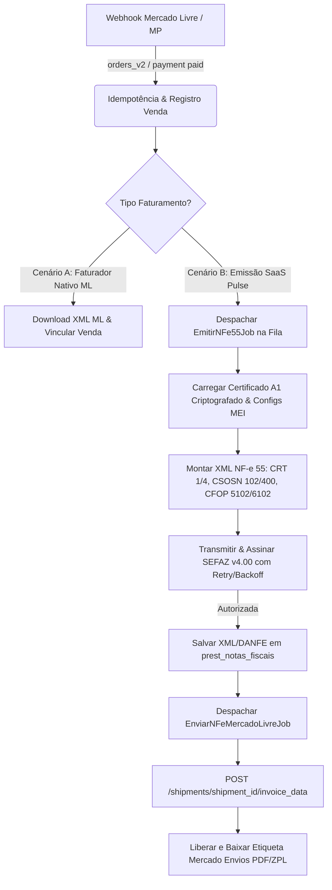

# PROMPT MESTRE DE EXECUÇÃO: SISTEMA FISCAL MULTITENANT (NF-e 55 MEI) & INTEGRAÇÃO MERCADO LIVRE / MERCADO PAGO

> **DOCUMENTO DE ENGENHARIA DE SOFTWARE & DIRETRIZES DE IMPLEMENTAÇÃO**  
> **Sistema:** Pulse ERP / SaaS Multitenant (Yii2 / PHP 8.1+ / PostgreSQL)  
> **Objetivo:** Implementar o fluxo completo de emissão de NF-e (Modelo 55) para lojistas MEI (Simples Nacional), com isolamento estrito de certificados digitais A1, processamento assíncrono via mensageria/filas, webhooks Mercado Livre e desbloqueio de etiquetas Mercado Envios.

---

## 🎯 INSTRUÇÃO DE CONTEXTO E PAPEL

Você atuará como **Engenheiro de Software Sênior Especialista em Arquitetura SaaS Multitenant, Mensageria Assíncrona e Sistemas Fiscais Brasileiros (SPED/SEFAZ)**.
Sua missão é executar todas as alterações de código, criação de migrations de banco de dados, refatoração de classes legadas e testes ponta a ponta necessários para habilitar a emissão fiscal multitenant para microempreendedores (MEI) e sellers do Mercado Livre no Pulse ERP.

---

## 🏗️ MAPA DO ECOSSISTEMA E ARQUITETURA ATUAL

- **Framework Core:** Yii2 Basic Framework (PHP 8.1+, Composer).
- **Banco de Dados:** PostgreSQL 14+ com isolamento lógico multitenant baseado em `usuario_id` (UUIDv4) nas tabelas `prest_*` e `marketplace_*`.
- **Biblioteca Fiscal:** `nfephp-org/sped-nfe` e `nfephp-org/sped-da` já presentes no `vendor/`.
- **Mecanismo de Filas:** `yiisoft/yii2-queue` (DbQueue) com tabela `prest_queue`, monitorado pelo systemd daemon `pulse-queue.service`.
- **Servidores de Produção:**
  - **VPS 1:** `catalogos.oncode.app.br` (IP `2.25.182.204`, DB `alex_bird`, diretório `/srv/http/alex-birds/pulse-plus`).
  - **VPS 2:** `top-construcoes.catalogo.cloud` (IP `72.61.221.180`, DB `pulse_top_construcoes`, diretório `/srv/http/pulse-top-construcoes`).
  - **Local/Staging:** `/srv/http/pulse`.

---

## 🚨 VULNERABILIDADES E LIMITAÇÕES ATUAIS IDENTIFICADAS

1. **Insegurança de Certificados A1:** `prest_configuracoes.certificado_pfx` armazena binário em Base64 puro (sem criptografia em repouso) e `prest_configuracoes.certificado_senha` armazena a chave privada em texto plano (plain text).
2. **Duplicidade e Incompatibilidade Fiscal:**
   - `components/NFwService.php` e `NFwBuilder.php` são multitenant, mas emitem **somente NFC-e (Modelo 65)**, com UF de São Paulo (`cUF 35`, `cMunFG 3550308`), CFOP `5102` e NCM fictício `00000000` fixos no código.
   - `components/nfe/NFeService.php` e `NFeBuilder.php` são **mono-tenant**, consumindo credenciais estáticas de teste de `config/params.php` (`only-code.pfx`).
   - Falta suporte a operações interestaduais (obrigatórias no e-commerce nacional): `idDest = 2` e `CFOP = 6102`.
3. **Bloqueio no Mercado Envios:**
   - O método `MercadoLivreService::uploadNfe()` aponta para o endpoint depreciado `/orders/{id}/fiscal_documents`.
   - O endpoint oficial e obrigatório para liberar etiquetas no Mercado Envios Brasil é `POST /shipments/{shipment_id}/invoice_data`.
   - O webhook `MercadoLivreWebhookHandler.php` descarta silenciosamente eventos de `shipments`, `payments` e `invoices` apenas registrando log (`'action' => 'logged'`).
   - O processador `OrderEventProcessor::convertToOfficialSale()` cria a venda local e dá baixa de estoque, mas não dispara o pipeline fiscal.

---

## 📋 PLANO DE EXECUÇÃO DETALHADO (4 FASES)



---

### FASE 1: SEGURANÇA MULTITENANT & CRIPTOGRAFIA DE CERTIFICADOS A1

#### 1.1. Migration do Banco de Dados
Criar a migration `sql/postgres/006_seguranca_fiscal_e_notas_fiscais.sql`:
- Garantir que `prest_configuracoes.certificado_pfx` e `prest_configuracoes.certificado_senha` sejam do tipo `TEXT` ou `BYTEA` adequados para armazenar payloads criptografados.
- Adicionar colunas de controle fiscal e regime à tabela `prest_configuracoes`:
  - `nfe_serie` (INTEGER DEFAULT 1)
  - `nfe_numero_atual` (INTEGER DEFAULT 0)
  - `faturador_ml_tipo` (VARCHAR(30) DEFAULT 'PULSE_ERP') -- Opções: 'PULSE_ERP', 'MERCADO_LIVRE'
  - `ibge_municipio` (VARCHAR(7)) -- Código IBGE de 7 dígitos da empresa
  - `uf_sigla` (VARCHAR(2))
  - `cnae` (VARCHAR(10))
- Criar a tabela `prest_notas_fiscais`:
  ```sql
  CREATE TABLE IF NOT EXISTS prest_notas_fiscais (
      id UUID PRIMARY KEY DEFAULT gen_random_uuid(),
      usuario_id UUID NOT NULL REFERENCES prest_usuarios(id) ON DELETE CASCADE,
      venda_id UUID REFERENCES prest_vendas(id) ON DELETE SET NULL,
      marketplace_pedido_id VARCHAR(100),
      marketplace VARCHAR(50),
      modelo VARCHAR(2) NOT NULL DEFAULT '55', -- '55' = NF-e, '65' = NFC-e
      serie INTEGER NOT NULL DEFAULT 1,
      numero INTEGER NOT NULL,
      chave_acesso VARCHAR(44) UNIQUE,
      protocolo_autorizacao VARCHAR(100),
      status_sefaz VARCHAR(30) NOT NULL DEFAULT 'PENDENTE', -- 'PENDENTE', 'AUTORIZADA', 'REJEITADA', 'CANCELADA'
      cstat VARCHAR(10),
      xmotivo TEXT,
      xml_envio TEXT,
      xml_autorizado TEXT,
      pdf_danfe_path VARCHAR(500),
      ambiente SMALLINT NOT NULL DEFAULT 2, -- 1 = Produção, 2 = Homologação
      data_emissao TIMESTAMP WITH TIME ZONE DEFAULT NOW(),
      data_autorizacao TIMESTAMP WITH TIME ZONE,
      data_criacao TIMESTAMP WITH TIME ZONE DEFAULT NOW(),
      data_atualizacao TIMESTAMP WITH TIME ZONE DEFAULT NOW()
  );
  CREATE INDEX IF NOT EXISTS idx_notas_fiscais_tenant ON prest_notas_fiscais(usuario_id);
  CREATE INDEX IF NOT EXISTS idx_notas_fiscais_venda ON prest_notas_fiscais(venda_id);
  CREATE INDEX IF NOT EXISTS idx_notas_fiscais_chave ON prest_notas_fiscais(chave_acesso);
  ```

#### 1.2. Criptografia em Repouso no Model `Configuracao.php`
- Localização: `modules/vendas/models/Configuracao.php`
- Definir chave de criptografia derivada de variável de ambiente:
  `$key = getenv('APP_FISCAL_ENCRYPTION_KEY') ?: Yii::$app->params['cookieValidationKey'];`
- Implementar `beforeSave()`:
  - Se `$this->certificado_arquivo` for enviado (upload `.pfx`):
    - Ler binário: `$pfxRaw = file_get_contents($this->certificado_arquivo->tempName);`
    - Validar se o certificado é um PKCS#12 válido via `openssl_pkcs12_read($pfxRaw, $certs, $this->certificado_senha)`. Lançar erro se a senha não abrir o arquivo!
    - Criptografar binário: `$this->certificado_pfx = base64_encode(Yii::$app->security->encryptByKey($pfxRaw, $key));`
  - Se `$this->certificado_senha` for alterada:
    - Criptografar senha: `$this->certificado_senha = base64_encode(Yii::$app->security->encryptByKey($this->certificado_senha, $key));`
- Implementar métodos de conveniência:
  - `public function getCertificadoBinarioDescriptografado(): ?string`: Executa `Yii::$app->security->decryptByKey(base64_decode($this->certificado_pfx), $key)`.
  - `public function getCertificadoSenhaDescriptografada(): ?string`: Executa `Yii::$app->security->decryptByKey(base64_decode($this->certificado_senha), $key)`.
- **Limpeza de Segurança:** Remover credenciais e senhas estáticas de certificados em `config/params.php`.

---

### FASE 2: MOTOR FISCAL UNIFICADO (NF-e MODELO 55 PARA MEI)

#### 2.1. Unificação dos Serviços Fiscais
Criar namespace limpo e centralizado: `app\components\fiscal\`
- `FiscalService.php`: Orquestrador de alto nível para transmissão, consulta de recibo, cancelamento e geração de DANFE.
- `NFe55Builder.php`: Montador do layout XML v4.00 com regras estritas de MEI.
- Depreciar / unificar classes antigas de `components/NFwService.php` e `components/nfe/NFeService.php`.

#### 2.2. Regras Fiscais Específicas para MEI (Microempreendedor Individual)
No `NFe55Builder.php`:
1. **Regime Tributário (CRT):**
   - Configurar `CRT = 1` (Simples Nacional) ou `CRT = 4` (MEI - conforme Nota Técnica 2024.001 da SEFAZ, se parametrizado).
2. **Dados do Emitente:**
   - CNPJ, Razão Social, Nome Fantasia, Inscrição Estadual (IE ou 'ISENTO').
   - Endereço completo com código IBGE do município (`cMun`) e código da UF (`cUF`).
3. **Dados do Destinatário:**
   - Para envio via Mercado Livre/Mercado Envios, destinatário completo é **obrigatório** na NF-e 55:
     - `CNPJ` ou `CPF`.
     - `xNome` (Razão Social ou Nome Completo).
     - `indIEDest = 9` (Não Contribuinte).
     - `enderDest`: `xLgr`, `nro`, `xCpl`, `xBairro`, `cMun` (IBGE 7 dígitos), `xMun`, `UF`, `CEP` (8 dígitos), `cPais = 1058`, `xPais = BRASIL`.
4. **Definição Dinâmica de Destino e Operação Fiscal:**
   - Comparar `UF_Destinatario` com `UF_Emitente`:
     - Se `UF_Dest == UF_Emit`: `idDest = 1` (Operação Interna), `CFOP = 5102` (Venda de mercadoria adquirida de terceiros).
     - Se `UF_Dest != UF_Emit`: `idDest = 2` (Operação Interestadual), `CFOP = 6102` (Venda de mercadoria adquirida de terceiros para outro estado).
5. **Tributação do Item (MEI sem destaque de tributos):**
   - **ICMS:**
     - Usar grupo `ICMSSN102` (ou `ICMSSN400` para mercadorias não tributadas pelo Simples):
       - `orig = 0` (Nacional) ou conforme origem do produto.
       - `CSOSN = 102` (Tributada pelo Simples Nacional sem permissão de crédito).
       - Não gerar tags de alíquotas ou valores de ICMS próprio.
   - **PIS:**
     - Tag `PISNT` ou `PISOutr` com `CST = 07` ou `08` (Operação isenta ou sem incidência para MEI).
   - **COFINS:**
     - Tag `COFINSNT` ou `COFINSOutr` com `CST = 07` ou `08`.
   - **Validação de NCM:**
     - Não permitir NCM genérico `00000000`. Se o produto não tiver NCM cadastrado, bloquear emissão com mensagem clara para o lojista configurar o NCM correto no cadastro de produtos.
6. **Controle Sequencial de Numeração:**
   - Realizar lock atômico no banco para incremento de `nfe_numero_atual` (`UPDATE prest_configuracoes SET nfe_numero_atual = nfe_numero_atual + 1 WHERE usuario_id = ... RETURNING nfe_numero_atual`).

---

### FASE 3: PIPELINE DE FILAS ASSÍNCRONAS E CONTINGÊNCIA SEFAZ

#### 3.1. Job de Emissão Fiscal (`app\jobs\EmitirNFe55Job.php`)
- Implementar `yii\queue\RetryableJobInterface`:
  - `public function getTTime(): int { return 30; }` (Espera 30s entre retentativas).
  - `public function canRetry($attempt, $error): bool`: Permite até 3 retentativas para erros de timeout (HTTP 500, 502, 504 da SEFAZ ou cStat 108/109 - serviço paralisado).
- Fluxo de Execução do Job:
  1. Carregar registro da Venda e Configuração do Tenant.
  2. Verificar se já existe NF-e autorizada para esta venda (garantia de idempotência estrita).
  3. Gerar XML via `NFe55Builder`.
  4. Assinar digitalmente com o certificado A1 descriptografado.
  5. Enviar lote para a SEFAZ em modo síncrono (`enviaLote([$xml], $lote, 1)` se suportado pelo estado, ou consulta de recibo assíncrono).
  6. Processar resposta da SEFAZ:
     - **cStat 100 (Autorizado o uso da NF-e):**
       - Gerar XML protocolado (`Complements::toAuthorize($xml, $protocoloXml)`).
       - Gerar DANFE PDF via `NFePHP\DA\NFe\Danfe` e salvar no storage seguro (`uploads/nfe/{usuario_id}/{chave}.pdf`).
       - Atualizar `prest_notas_fiscais` com status `AUTORIZADA`, protocolo e chave.
       - Se a venda tiver origem no Mercado Livre (`marketplace == 'MERCADO_LIVRE'`), disparar imediatamente o job `EnviarNFeMercadoLivreJob`.
     - **Rejeição Definitiva (ex: cStat 204 duplicidade, cStat 539, etc.):**
       - Gravar status `REJEITADA`, registrar `cstat` e `xmotivo` para exibição na UI do vendedor.
       - Não retentar automaticamente.

---

### FASE 4: INTEGRAÇÃO MERCADO LIVRE & MERCADO ENVIOS

#### 4.1. Refatoração do Webhook (`MercadoLivreWebhookHandler.php`)
- Tratar topic `orders_v2`:
  - Buscar dados completos do pedido via API (`/orders/{resource_id}`).
  - Se `status == 'paid'`:
    - Processar pedido via `OrderEventProcessor`.
    - Verificar configuração do lojista:
      - **Cenário A (`faturador_ml_tipo == 'MERCADO_LIVRE'`):**
        - Chamar `MercadoLivreService::fetchNativeInvoice($orderId)` para obter o XML emitido pelo ML e arquivar localmente.
      - **Cenário B (`faturador_ml_tipo == 'PULSE_ERP'`):**
        - Despachar `Yii::$app->queue->push(new EmitirNFe55Job(['vendaId' => $venda->id]));`
- Tratar topic `shipments`:
  - Atualizar código de rastreamento, transportadora e status do envio em `prest_marketplace_pedido`.

#### 4.2. Correção da API de Despacho Mercado Envios (`MercadoLivreService.php`)
Substituir o método `uploadNfe()` pela implementação padrão do Mercado Envios Brasil:
```php
public function postShipmentInvoiceData(string $shipmentId, string $chaveAcesso, ?string $xml = null): bool
{
    $this->garantirTokenValido();

    $chaveLimpa = preg_replace('/\D/', '', $chaveAcesso);
    if (strlen($chaveLimpa) !== 44) {
        throw new \InvalidArgumentException("Chave de acesso inválida. Deve conter 44 dígitos.");
    }

    try {
        // Endpoint oficial para envio de nota fiscal no Mercado Envios Brasil
        $url = "{$this->apiBaseUrl}/shipments/{$shipmentId}/invoice_data";
        
        $payload = [
            'fiscal_key' => $chaveLimpa,
        ];
        
        if ($xml) {
            $payload['xml'] = base64_encode($xml);
        }

        $response = $this->request('POST', $url, [
            'headers' => $this->getAuthHeaders(),
            'json' => $payload,
        ]);

        Yii::info("[MercadoLivreService] Nota fiscal vinculada com sucesso ao envio {$shipmentId}.", 'marketplace');
        return true;
    } catch (\Throwable $e) {
        $this->handleError($e, "postShipmentInvoiceData ({$shipmentId})");
        return false;
    }
}
```

#### 4.3. Job de Envio ao Mercado Livre (`app\jobs\EnviarNFeMercadoLivreJob.php`)
- Recebe `notaFiscalId`.
- Localiza `MarketplacePedido` vinculado e extrai o `shipment_id` (de `dados_completos['shipping']['id']`).
- Executa `MercadoLivreService::postShipmentInvoiceData($shipmentId, $nota->chave_acesso, $nota->xml_autorizado)`.
- Se tiver sucesso:
  - Invoca `MercadoLivreService::getShippingLabelPdf($shipmentId)` para baixar a etiqueta de frete já liberada.
  - Salva o PDF da etiqueta no storage e atualiza o pedido com a etiqueta pronta para impressão.

---

## 🧪 ROTEIRO DE TESTES E VALIDAÇÃO

1. **Teste de Criptografia:**
   - Fazer upload de um arquivo `.pfx` com senha.
   - Verificar diretamente no PostgreSQL via `psql` se os campos `certificado_pfx` e `certificado_senha` estão cifrados (não contendo base64 pura nem a senha em texto legível).
   - Instanciar a leitura do certificado e validar se a classe `Certificate::readPfx` carrega as chaves sem erros.
2. **Teste de Emissão Homologação (SEFAZ):**
   - Emitir venda de teste interestadual (Emitente: SP -> Cliente: RJ).
   - Validar se o XML gerado contém `idDest = 2`, `CFOP = 6102`, `CRT = 1` e `CSOSN = 102`.
   - Verificar se a SEFAZ de homologação retorna autorização (cStat 100).
3. **Teste de Webhook e Mercado Envios:**
   - Disparar payload simulado de `orders_v2` com `status = 'paid'`.
   - Verificar se o `EmitirNFe55Job` entra na fila `prest_queue` e é processado pelo worker `pulse-queue`.
   - Verificar se após a autorização o `EnviarNFeMercadoLivreJob` realiza o POST em `/shipments/{shipment_id}/invoice_data`.

---

## 📌 CRITÉRIOS DE ACEITAÇÃO

- [ ] Isolamento multitenant estrito: nenhum lojista pode acessar certificado, vendas ou notas de outro lojista.
- [ ] Chaves privadas e senhas dos certificados 100% cifradas em repouso no banco de dados.
- [ ] Emissão de NF-e Modelo 55 autorizada pela SEFAZ com regras corretas de MEI (sem destaque indevido de ICMS/PIS/COFINS).
- [ ] Tratamento automático de operações internas (CFOP 5102) e interestaduais (CFOP 6102).
- [ ] Desbloqueio e download automático da etiqueta do Mercado Envios após a autorização fiscal.
- [ ] Nenhuma chamada bloqueante para a SEFAZ dentro da requisição HTTP do usuário (100% via filas).

---
*Documento gerado como especificação técnica pronta para execução e refatoração no Pulse ERP.*
