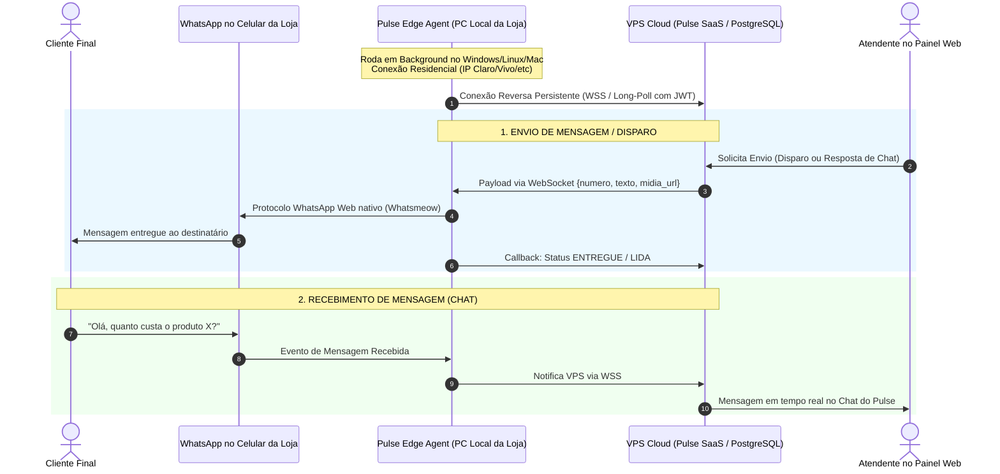
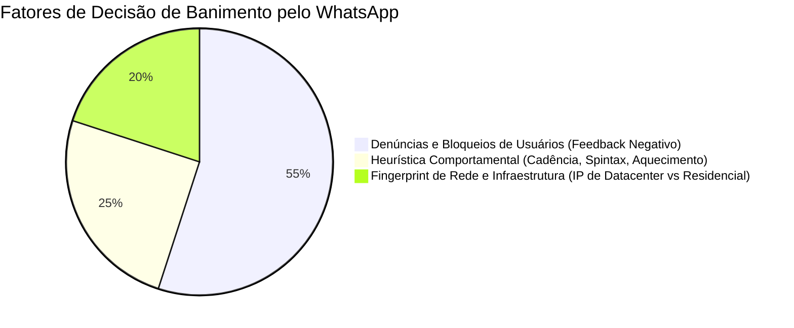

# Documento Técnico de Engenharia & Arquitetura de Software

**Título:** Análise de Viabilidade Técnica e Arquitetural do Pulse Bridge (Edge Agent Go) para Mensageria e Atendimento WhatsApp sem Custos de API Oficial  
**Projeto:** SaaS PULSE / PULSE-PLUS  
**Data:** Setembro / 2026  
**Autor:** Engenharia de Sistemas Distribuídos  

---

## Sumário Executivo

A recente implementação do **Pulse Bridge** em Golang — estabelecendo uma ponte assíncrona segura entre a nuvem (VPS) e o ambiente de borda (computador local da loja) — comprovou a eficiência da arquitetura **Edge-to-Cloud**. O modelo resolveu de forma definitiva o bloqueio de bot e restrições de rede impostas pelo YouTube contra IPs de data center.

Este documento analisa a expansão dessa exata mesma filosofia de engenharia para o ecossistema de mensageria instantânea (**WhatsApp**), eliminando os custos por conversa da API Oficial da Meta (Cloud API) e mitigando os riscos sistêmicos de banimento em massa decorrentes do uso de instâncias centralizadas em data centers.

---

## 1. O Problema Atual: Por que Soluções Centralizadas de WhatsApp Falham?

### 1.1 O Vetor do Banimento por ASN / Data Center
Quando uma empresa roda ferramentas como Baileys, WPPConnect ou Evolution API em uma VPS centralizada (Hetzner, OVH, AWS, DigitalOcean, Oracle Cloud):
1. **Identificação de ASN Não-Residencial**: A Meta monitora ativamente as faixas de IPs pertencentes a provedores de hospedagem (*Hosting/Transit ASNs*).
2. **Efeito "Agulha no Palheiro" Invertido**: Um usuário comum de WhatsApp se conecta através de ASN residencial ou móvel (Claro, Vivo, TIM, Starlink, provedores de fibra locais). Quando dezenas de conexões WebSocket de WhatsApp Web partem de um mesmo IP de data center com tráfego unidirecional intenso, o algoritmo heurístico da Meta classifica a conexão como **Bot/Automação Ilegítima**, derrubando o socket e aplicando banimento permanente no número.
3. **Contaminação Cruzada de Tenants**: Em um SaaS multi-empresa centralizado, se a Loja A fizer disparos abusivos e for banida, o IP do servidor é colocado na *greylist* da Meta, aumentando a taxa de desconexão e banimento das Lojas B, C e D que compartilham o mesmo servidor.

### 1.2 O Custo Proibitivo da Meta Cloud API
A API Oficial (Cloud API da Meta) resolve o banimento por IP, mas introduz:
- Cobrança em dólar por conversa iniciada pela empresa (Marketing Templates custam ~$0.06 a $0.08 USD por conversa).
- Processo burocrático de verificação de empresa (BM do Facebook), limites iniciais de 250 conversas/dia e aprovação restritiva de modelos de mensagem.
- Para pequenos e médios varejistas do SaaS, esse custo inviabiliza campanhas de ofertas semanais e encartes digitais.

---

## 2. A Arquitetura Proposta: Pulse Edge Agent (Go + Whatsmeow)

Em vez de hospedar o motor de WhatsApp na VPS, o **Pulse Edge Agent** (evolução do nosso `pulse-bridge`) passa a rodar localmente no computador/notebook de cada lojista.



---

## 3. Análise Crítica: "Sem Risco de Banimento" — Mito vs. Realidade

É vital discernir a realidade técnica do discurso de marketing. O banimento do WhatsApp opera sob **três pilares independentes**:



| Pilar de Risco | O que a Meta analisa? | Como a Arquitetura Edge resolve? | Status |
|---|---|---|:---:|
| **1. Infraestrutura & Rede** | IP de Datacenter, portas suspeitas, múltiplos WebSockets no mesmo IP. | **100% resolvido**. O tráfego sai da internet residencial/comercial da loja, com o mesmo IP onde o celular do lojista já opera. | 🟢 **IMUNE A ESSE VETOR** |
| **2. Heurística de Envio** | Enviar 50 mensagens em 1 segundo; não simular digitação (`composing`); texto idêntico. | **Mitigado por software**. O agente Go implementa pausas humanas aleatórias (15s–45s), spintax e simulação de presença. | 🟡 **CONTROLÁVEL VIA CÓDIGO** |
| **3. Rejeição Social (Denúncias)** | Destinatários clicando em *"Denunciar e Bloquear"*. | **Não depende do IP**. Se a loja disparar para listas frias sem permissão e 3 clientes denunciarem, o chip cairá mesmo conectado no Wi-Fi da loja. | 🔴 **RESPONSABILIDADE DO LOJISTA** |

> [!IMPORTANT]
> **Conclusão sobre banimento**: A arquitetura do Pulse Edge Agent elimina **100% dos banimentos por fingerprint de infraestrutura** (o maior vilão de quem usa VPS). Todavia, para garantir a longevidade do chip, o sistema deve impor limites de cadência diária, rotação de mensagens e regras de *opt-in*.

---

## 4. Modelos de Integração: Isolado vs. Conjunto com Evolution Go

Existem duas abordagens de implementação para o ecossistema:

### Abordagem A: Pulse Edge Integrado Nativo (Go + Whatsmeow) — [RECOMENDADA]
Em vez de instalar uma stack pesada com Docker e Node.js no computador do cliente, compilamos o binário do **Pulse Bridge** já embutindo a biblioteca **`whatsmeow`** (a mesma biblioteca de baixo nível em Golang utilizada internamente pelo Evolution Go).

* **Como fica o executável**: Um único binário executável (`pulse-agent.exe` no Windows ou binário ELF no Linux/Mac) de ~28 MB.
* **Consumo de recursos**: Menos de **35 MB de RAM** no computador do cliente.
* **Instalação**: O lojista apenas clica duas vezes no instalador. Não requer Docker, não requer Node.js, não requer conhecimento técnico.
* **Funcionalidades unificadas**: O mesmo agente atende à ponte do YouTube (corte de áudios em 11s) e à ponte do WhatsApp.

### Abordagem B: Agente Local Conectado a um Evolution Go Remoto via Túnel
Neste modelo, o Evolution Go continuaria rodando na nuvem, mas o tráfego seria roteado pelo computador do cliente via túnel (ex: Tailscale ou proxy reverso SOCKS5).

* **Desvantagens**: Alta complexidade de configuração de rede, dependência de túneis WireGuard gerenciados, alto consumo de banda do lojista e maior propensão a quedas de conexão.

---

## 5. Arquitetura Detalhada do "Pulse Edge Agent" (Abordagem A)

### 5.1 Especificação de Componentes

```
┌─────────────────────────────────────────────────────────────┐
│                   COMPUTADOR DA LOJA                        │
│                                                             │
│   ┌─────────────────────────────────────────────────────┐   │
│   │           Pulse Edge Agent (Golang Binário)         │   │
│   │                                                     │   │
│   │   [Módulo YouTube]        [Módulo WhatsApp Engine]  │   │
│   │   - yt-dlp nativo         - whatsmeow (Go)          │   │
│   │   - extração AAC/M4A      - SQLite local p/ sessão  │   │
│   │                           - Fila de envio cadenciada│   │
│   │                                                     │   │
│   │   [Gerenciador de Conexão WebSocket Reverso]        │   │
│   │   - Reconexão automática backoff                    │   │
│   │   - Heartbeat a cada 30s                            │   │
│   │   - Handshake com Tenant Token                      │   │
│   └──────────────────────────┬──────────────────────────┘   │
└──────────────────────────────┼──────────────────────────────┘
                               │
                      WSS Seguro (Porta 443)
              Outbound Only (Sem portas abertas na loja)
                               │
┌──────────────────────────────▼──────────────────────────────┐
│                    VPS PULSE (CLOUD)                        │
│                                                             │
│   [WebSocket Gateway (Go ou Node.js / Ratchet)]             │
│   - Mapeia Tenant ID <-> Conexão Socket Ativa               │
│                                                             │
│   [Módulo de Mensageria PULSE (Yii2 / PostgreSQL)]          │
│   - Disparo em Massa & CRM                                  │
│   - Chat Central de Atendimento                             │
│   - Catálogo Digital & Notificações de Venda                │
└─────────────────────────────────────────────────────────────┘
```

### 5.2 Fluxo de Pareamento (Leitura de QR Code)
1. O lojista acessa a tela do Pulse Web: `https://catalogos.oncode.app.br/evolution/config`.
2. Se o agente local estiver conectado, o painel exibe o status **"Agente Local Ativo (IP Residencial)"**.
3. O lojista clica em **"Conectar WhatsApp"**.
4. A VPS envia o comando `generate_qr` via WebSocket para o agente local.
5. O motor `whatsmeow` no agente local gera a chave pública de pareamento e emite o QR Code (string base64).
6. O QR Code é exibido instantaneamente no modal web do lojista.
7. O lojista aponta o WhatsApp do celular e escaneia.
8. As chaves criptográficas da sessão são gravadas em um banco local seguro SQLite (`session.db`) no PC da loja. **As chaves privadas do WhatsApp nunca precisam sair da máquina do lojista**, elevando a segurança e privacidade do sistema.

### 5.3 O que acontece se o lojista desligar o computador?
- **Detecção Imediata**: A VPS percebe o corte do heartbeat WebSocket em 30 segundos e marca a loja como **"Agente Offline"**.
- **Fila Inteligente**: Mensagens de disparo em massa ou confirmações de pedidos ficam em estado `PENDING_AGENT` no PostgreSQL.
- **Retomada Automática**: Assim que o lojista ligar o computador no dia seguinte, o serviço inicia com o sistema operacional, reconecta na VPS e escoa a fila respeitando os intervalos seguros.

---

## 6. Matriz Comparativa de Viabilidade

| Dimensão | Meta Cloud API (Oficial) | Evolution Centralizado (VPS) | Pulse Edge Agent (Local Go) |
|---|---|---|---|
| **Custo de Mensageria** | Alto (cobrado por conversa em USD) | R$ 0,00 | **R$ 0,00** |
| **Custo de Infraestrutura VPS** | Mínimo (apenas chamadas HTTP REST) | Muito Alto (muita RAM/CPU para dezenas de instâncias) | **Mínimo** (a carga roda nos PCs dos clientes) |
| **Risco de Ban por IP/Data Center** | Nulo | **Altíssimo** (bloqueio de sub-rede frequente) | **Nulo** (IP residencial do lojista) |
| **Privacidade das Chaves WhatsApp** | Na Meta | No servidor central do SaaS | **100% no computador do cliente** |
| **Disponibilidade / Uptime** | 99.9% (Nuvem Meta) | Depende da VPS | Depende do PC da loja estar ligado |
| **Facilidade de Adoção** | Difícil (requer verificação de CNPJ/BM) | Média (QR Code lido na web) | **Alta** (download de executável leve + QR Code) |

---

## 7. Roadmap de Implementação Proposto

### Fase 1: Prova de Conceito do Módulo Whatsmeow no Agente
- Adicionar o pacote `go.mau.fi/whatsmeow` ao projeto existente `services/pulse-bridge`.
- Implementar a rotina de login via terminal/QR Code e envio de uma mensagem de teste "Hello World".
- Validar consumo de memória e estabilidade da sessão SQLite.

### Fase 2: Protocolo WebSocket Reverso e Pareamento Remoto
- Implementar o servidor WebSocket na VPS para receber as conexões dos agentes com autenticação por token da loja (`usuario_id`).
- Criar a ponte para repassar o QR Code gerado localmente até o navegador do lojista no painel do Pulse.

### Fase 3: Integração com as Rotinas Existentes do Pulse
- Integrar os disparadores do Pulse (`DisparoMassaService.php` e `EvolutionService.php`) para despachar para a conexão do Agente Local quando configurado.
- Recepção de mensagens de entrada (inbound) e inserção na tela de atendimento/chat do Pulse.

### Fase 4: Empacotamento para o Usuário Final
- Criar o instalador `.exe` para Windows (com inicialização automática no boot do Windows).
- Ícone na bandeja do sistema (*System Tray*) mostrando status: "🟢 Conectado à Loja X" / "🔴 Desconectado".

---

## 8. Conclusão e Veredito Técnico

A arquitetura de **Ponte Local (Edge Agent)** provou ser a solução técnica mais elegante e econômica para contornar bloqueios de data center. 

Adotar essa mesma tecnologia para o WhatsApp via **Golang + Whatsmeow**:
1. **É 100% viável tecnicamente** e aproveita toda a base que acabamos de construir no `services/pulse-bridge`.
2. **Elimina a maior causa de banimento precoce de números** (a detecção de IP de data center pela Meta).
3. **Zera a conta de infraestrutura de mensageria da VPS**, permitindo escalar o SaaS Pulse para milhares de lojas sem que o servidor sobrecarregue de memória.
4. Transforma o Pulse em uma solução extremamente atrativa para o lojista, que pode disparar seus encartes e vídeos promocionais sem pagar taxas por mensagem.
