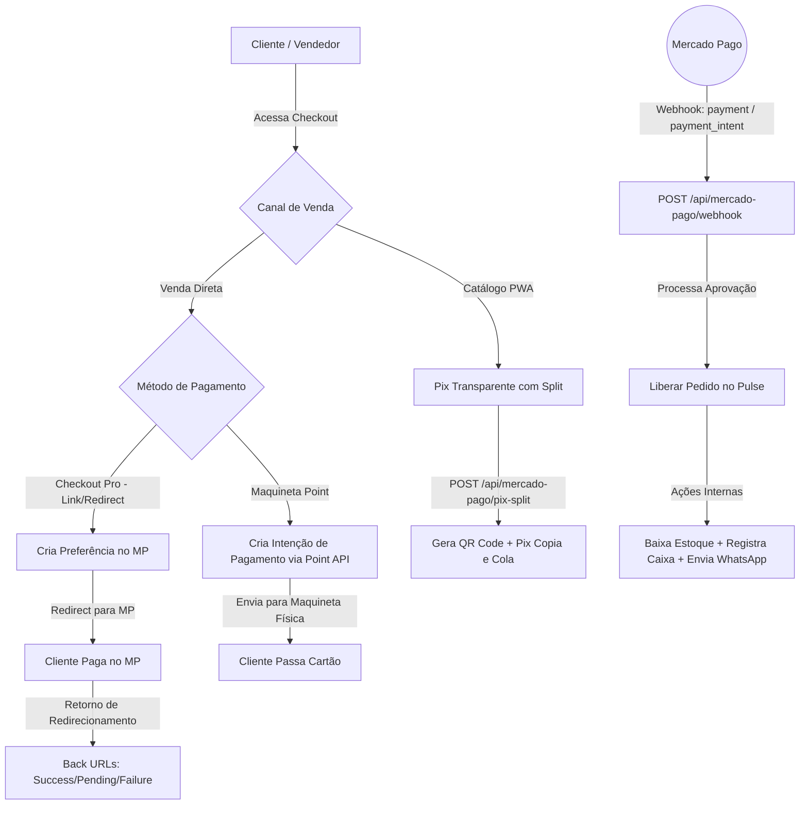

# Análise de Status da Integração com o Mercado Pago — Pulse Plus

Este documento apresenta a análise técnica detalhada da integração do sistema **Pulse Plus** com o gateway de pagamentos **Mercado Pago**, consolidando o que já está implementado (tanto no frontend quanto no backend) e identificando as lacunas (gaps) que precisam ser resolvidas para garantir o funcionamento correto e seguro em ambiente de produção.

---

## 🗺️ Fluxo de Integração

O diagrama a seguir descreve a arquitetura e os fluxos de pagamento suportados pelo Pulse Plus para o Mercado Pago:



---

## 1. 🔍 O Que Já Está Implementado

A integração do Mercado Pago no Pulse Plus está em estado avançado, contemplando os fluxos do **Catálogo PWA** e da **Venda Direta**.

### A. Backend (`app\modules\api\controllers\MercadoPagoController.php`)
*   **OAuth e Conexão Multi-Tenant:**
    *   Endpoints `/api/mercado-pago/connect-url` e `/api/mercado-pago/oauth-callback` prontos para realizar o vínculo de contas dos lojistas via fluxo oficial do Mercado Pago.
    *   Salva o `access_token`, `refresh_token`, `public_key`, `user_id` e a expiração do token na tabela `prest_usuarios`.
*   **Geração de Checkout Pro (Preferences):**
    *   Endpoint `/api/mercado-pago/criar-preferencia` gera o link de redirecionamento.
    *   Contempla tratamento de erros (Workaround de desserialização via Guzzle HTTP Client) omitindo campos de cidade (`city`/`city_name`) que costumam quebrar a SDK oficial do PHP.
    *   Salva a preferência de checkout na tabela local `mercadopago_preferencias`.
*   **Pix Transparente com Split:**
    *   Endpoint `/api/mercado-pago/pix-split` gera o Pix direto (com Split de comissão da plataforma).
*   **Mercado Pago Point (Maquineta Física):**
    *   Endpoint `/api/mercado-pago/criar-pagamento-point` envia comandos diretamente para a maquineta vinculada ao `device_id` do vendedor usando a Point API.
    *   Endpoints `/api/mercado-pago/registrar-dispositivo` e `/api/mercado-pago/remover-dispositivo` para gerenciar as maquinetas ativas no banco de dados.
*   **Webhook unificado (`/api/mercado-pago/webhook`):**
    *   Suporta notificações tradicionais de pagamento (`payment`) e notificações das maquinetas (`payment_intent`).
    *   Resolve o token do vendedor de forma eficiente: busca no parâmetro `tenant_id` da URL, ou usa o `user_id` do payload, ou usa o token master, ou faz um fallback resiliente.
    *   Se aprovado (`approved`), chama `liberarPedido()`.
*   **Automação e Pós-Venda:**
    *   Aprovação de pedido: muda status para `QUITADA` (pago).
    *   Estoque: baixa de estoque automatizada baseada nos itens vendidos.
    *   Finanças: registra entrada bruta no caixa do lojista e a saída da comissão retida (SaaS fee) usando o `CaixaHelper`.
    *   Notificação: envia mensagem de confirmação formatada com recibo via WhatsApp (Evolution API).

### B. Frontend do Catálogo (`web/catalogo/`)
*   **Configuração:** Detecta chaves públicas e modo sandbox a partir de endpoint do usuário.
*   **Pix Split:** Solicita pagamento via Pix no final do checkout, gera modal com QR Code e inicia polling de status para confirmação.
*   **Páginas de Retorno:** Páginas `payment-success.html`, `payment-failure.html` e `payment-pending.html` criadas e prontas no diretório, limpando o LocalStorage (carrinho, preferências) pós-venda.

### C. Frontend da Venda Direta (`web/venda-direta/`)
*   **Checkout Pro:** Redireciona para o Mercado Pago se selecionado.
*   **Maquineta Point:** Abre modal para seleção da maquineta (caso haja mais de uma), inicia a intent e abre tela de espera "Aguardando na Maquineta" com polling dinâmico.

---

## 2. ⚠️ Lacunas Críticas Identificadas (Gaps)

Embora o fluxo principal esteja codificado, existem **4 pontos falhos** no projeto que impedem o funcionamento correto ou criam sérias inconsistências:

### 🔴 Gap 1: Ausência de Geração de Parcelas no Banco de Dados (Inconsistência Financeira)
*   **O Problema:** No backend (`MercadoPagoController::criarPedido`), a venda é criada usando comandos SQL diretos (`INSERT INTO prest_vendas`). Esse fluxo ignora o ciclo de vida do ActiveRecord e **não gera as parcelas** correspondentes na tabela `prest_parcelas`. 
*   No entanto, na aprovação do webhook (`liberarPedido`), o código tenta buscar as parcelas para marcá-las como pagas:
    ```php
    $parcelas = \app\modules\vendas\models\Parcela::findAll(['venda_id' => $venda->id]);
    foreach ($parcelas as $parcela) { ... }
    ```
    Como as parcelas nunca foram criadas, o loop não roda, o banco não registra as parcelas como pagas, e a aba financeira do lojista apresentará inconsistência de dados.
*   **Solução:** Chamar explicitamente a função `$venda->gerarParcelas(...)` (que já existe modelada em `Venda.php`) dentro de `liberarPedido` caso nenhuma parcela seja encontrada.

### 🔴 Gap 2: Inconsistência de Caminhos do Webhook (Base URL)
*   **O Problema:** As URLs de webhook enviadas ao Mercado Pago variam na codificação:
    *   Em preferências: `{$baseUrl}/index.php/api/mercado-pago/webhook?tenant_id=...` (Assume que o Apache aponta direto para a pasta `web/` - *Modo Pulse*).
    *   Em Pix Split: `{$baseUrl}/pulse/web/index.php/api/mercado-pago/webhook?tenant_id=...` (Assume que o Apache aponta para a pasta root `/srv/http` - *Modo Padrão*).
*   Se o servidor estiver no modo incorreto, o Mercado Pago receberá erro `404` ao tentar notificar o webhook, travando a liberação das vendas automáticas.
*   **Solução:** Utilizar os recursos do Yii2 para resolver o caminho de forma 100% dinâmica e adaptativa:
    ```php
    $webhookUrl = Yii::$app->request->hostInfo . Yii::$app->request->baseUrl . '/index.php/api/mercado-pago/webhook?tenant_id=' . $tenantId;
    ```

### 🟡 Gap 3: Credenciais Ausentes no Arquivo `.env`
*   **O Problema:** O método `getMpAppConfig()` lê as credenciais de aplicativo da plataforma (usadas para o fluxo de OAuth dos vendedores) a partir de variáveis de ambiente:
    ```php
    'app_id' => getenv('MP_APP_ID') ?: getenv('MERCADO_PAGO_APP_ID'),
    'client_secret' => getenv('MP_CLIENT_SECRET') ?: getenv('MERCADO_PAGO_CLIENT_SECRET'),
    ```
    No entanto, o arquivo `.env` do projeto não possui essas chaves declaradas, impossibilitando que os lojistas façam a conexão da conta deles pelo botão "Conectar com Mercado Pago" em ambiente local/homologação.
*   **Solução:** Inserir os placeholders destas variáveis no arquivo `.env.example` e configurar as chaves do aplicativo no `.env` de desenvolvimento e produção.

### 🟡 Gap 4: Referência de `taxa_comissao` Inexistente na Tabela de Usuários
*   **O Problema:** No método `initSdk` do controller:
    ```php
    $this->taxaComissao = isset($usuario['taxa_comissao']) ? (float)$usuario['taxa_comissao'] : null;
    ```
    A coluna `taxa_comissao` **não está presente** no SELECT das funções `buscarUsuarioPorId` ou `buscarUsuarioPorMpUserId`, e também não existe na tabela `prest_usuarios`. O sistema acaba caindo sempre no fallback padrão de `0.005` (0,5%) definido no `config/params.php`.
*   **Solução:** Criar uma migration para adicionar a coluna `taxa_comissao` (se necessário permitir taxas personalizadas por lojista) ou padronizar o código para utilizar estritamente o `Yii::$app->params['pulse_platform_fee_percent']` de forma explícita.

---

## 3. 📈 Plano de Ação Recomendado

Para finalizar com sucesso a integração e ir para a produção com segurança, siga as etapas abaixo:

### Passo 1: Correção de Bugs (Backend)
1.  **Ajustar Webhook Base URL:** Modificar o `MercadoPagoController` para usar `Yii::$app->request->hostInfo . Yii::$app->request->baseUrl` em todas as rotas de notificação geradas.
2.  **Gerar Parcelas Automáticas:** Atualizar a lógica do webhook no backend para chamar `$venda->gerarParcelas($venda->forma_pagamento_id, $venda->data_primeiro_vencimento, $venda->intervalo_dias_parcelas ?? 30, true)` caso o select de parcelas não retorne dados no processamento da aprovação.

### Passo 2: Configuração do Ambiente
1.  Obter as credenciais da plataforma (App ID e Client Secret) no Painel de Desenvolvedores do Mercado Pago.
2.  Adicionar estas credenciais ao arquivo `.env` de produção.
3.  Configurar a URL de redirecionamento (Redirect URI) do OAuth no painel do Mercado Pago para apontar exatamente para o endpoint de callback do sistema em produção: `https://meudominio.com/index.php/api/mercado-pago/oauth-callback`.

### Passo 3: Testes em Sandbox
1.  Utilizar o script `tests/verify_mp_split.php` para validar a geração da preferência e aplicação do Split.
2.  Configurar contas de teste (comprador e vendedor sandbox) no painel do Mercado Pago.
3.  Executar um ciclo completo de compra no Catálogo PWA e na Venda Direta com cartão de testes para validar se:
    *   A venda é salva com status quitada.
    *   As parcelas de pagamento são criadas e liquidadas.
    *   O saldo de comissão é distribuído corretamente.
    *   A mensagem de confirmação chega no WhatsApp de teste.
